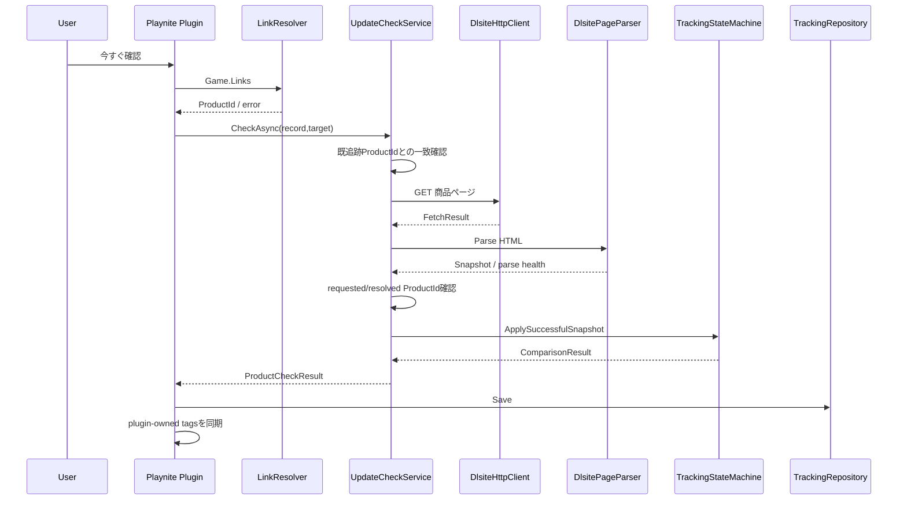
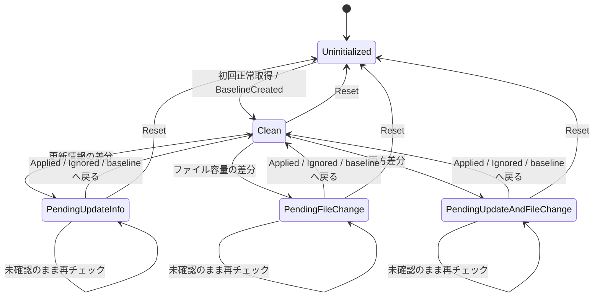

# DLsite Update Monitor — 開発・保守ガイド

この文書は、DLsite Update Monitorの開発継続、保守、コードレビュー、AIへの引き継ぎを目的とした開発者向け資料です。

今後の変更では、まずこのファイル、[README.md](README.md)、[CHANGELOG.md](CHANGELOG.md)、最新コードを確認してください。仕様の最終判断は**現在の実装とテスト**を基準にし、文書とコードが食い違う場合は、動作しているコードを勝手に文書へ合わせず差異を調査してください。

## 1. 現在の状態

| 項目 | 現在の状態 |
|---|---|
| 安定版として扱うVersion | 0.1.0 |
| Plugin Version | `src/DLsiteUpdateMonitor.Plugin/DLsiteUpdateMonitor.Plugin.csproj`: `0.1.0` |
| extension Version | `src/DLsiteUpdateMonitor.Plugin/extension.yaml`: `0.1.0` |
| Playnite | 10.56で実機検証済み |
| Plugin target | .NET Framework 4.6.2 |
| Core target | .NET Framework 4.6.2 / .NET 8.0 |
| Core tests | 63ケース PASS（v0.1.0リリース検証記録） |
| 実機Smoke Test | Gate A〜F PASS |
| 全ライブラリ実機確認 | DLsiteリンク登録済み33作品でPASS |
| `.pext`インストール | PASS |
| GitHub Release | 2026-09-14確認時点で未作成 |
| Git tag | 公開Tagを確認できていない |
| GitHub Actions / CI | 未導入 |
| License | 未設定 |

詳細な実機検証結果は [RELEASE_STATUS.md](RELEASE_STATUS.md)、手順は [docs/SMOKE_TEST.md](docs/SMOKE_TEST.md) を参照してください。

## 2. プロジェクトの責務

本プロジェクトは、Playniteで管理されるゲームの`Game.Links`からDLsite作品URLを見つけ、DLsite商品ページの配布状態を監視します。

v0.1.0で比較する信号は次の2つだけです。

1. `更新情報`
2. `ファイル容量`

ローカルにインストールされたゲーム本体のVersion、EXE情報、ファイルハッシュ、パッチ適用状態は判定しません。

### 重要な考え方

「最後に取得した状態」と比較するのではありません。

比較基準は常に、ユーザーが最後に確認済みとした`AcknowledgedSnapshot`です。新たに取得した候補は`CurrentSnapshot`となり、差分がある間は保留状態として残ります。

```text
AcknowledgedSnapshot
        │
        │ compare
        ▼
Candidate / CurrentSnapshot
        │
        ├─ 同じ          → Clean
        ├─ 更新情報差分   → PendingUpdateInfo
        ├─ 容量差分       → PendingFileChange
        ├─ 両方差分       → PendingUpdateAndFileChange
        └─ 安全に比較不能 → 既存の監視状態を変更しない
```

## 3. リポジトリ構成

```text
DLsite-Update-Monitor/
├─ src/
│  ├─ DLsiteUpdateMonitor.Core/
│  │  ├─ Http/           # DLsiteへのHTTP GET、間隔、timeout、retry
│  │  ├─ Models/         # Snapshot、状態、追跡DBモデル
│  │  ├─ Parsing/        # HTML解析、更新情報/容量の正規化
│  │  ├─ Persistence/    # tracking.jsonの安全な読み書き
│  │  └─ Services/       # 比較、状態機械、キャッシュ、作品ID解決
│  └─ DLsiteUpdateMonitor.Plugin/
│     ├─ DLsiteUpdateMonitorPlugin.cs  # Playnite統合のオーケストレーション
│     ├─ PlayniteTagService.cs         # プラグイン管理タグ
│     ├─ PluginSettings.cs             # 設定値・検証
│     ├─ PluginSettingsView.xaml       # 設定UI
│     └─ extension.yaml                # Playnite extension metadata
├─ tests/
│  └─ DLsiteUpdateMonitor.Core.Tests/  # Core自動テスト
├─ tools/
│  ├─ Validate-Build.ps1               # restore/test/build/payload検査
│  ├─ Install-Dev.ps1                  # 開発用配置
│  ├─ Package-Release.ps1              # 検証済みpayloadの.pext化
│  └─ Static-Validate.py               # 任意の静的事前検証
├─ docs/
│  ├─ ARCHITECTURE.md
│  ├─ RELEASE.md
│  ├─ SMOKE_TEST.md
│  └─ TROUBLESHOOTING.md
├─ README.md
├─ DEVELOPMENT.md
├─ CHANGELOG.md
├─ BUILD.md
├─ IMPLEMENTATION_NOTES.md
└─ RELEASE_STATUS.md
```

## 4. アーキテクチャ概要

詳細は [docs/ARCHITECTURE.md](docs/ARCHITECTURE.md) を参照してください。

主要レイヤーは次の3つです。

### Playnite統合層

`DLsiteUpdateMonitor.Plugin`

- Playniteメニュー
- 設定UI
- グローバル進捗
- ゲーム選択
- 状態変更操作
- タグ同期
- Coreサービスの組み立て

### Coreドメイン層

`DLsiteUpdateMonitor.Core`

- URLから作品ID解決
- HTTP取得
- HTML解析
- 正規化
- Snapshot検証
- Snapshot比較
- 状態遷移
- キャッシュ
- 永続化

CoreはPlaynite SDKへ依存せず、自動テスト可能な構成です。

### 永続化層

`TrackingRepository`

Playnite SDKが返すプラグインユーザーデータディレクトリに`tracking.json`等を保存します。絶対パスはコードへ固定しません。

## 5. 主要コードと責務

### `DLsiteUpdateMonitorPlugin`

**責務**

- Playnite APIとの接続
- 各Coreサービスの構築
- メニューの提供
- バッチ処理
- 保存タイミング
- タグ同期
- 状態変更操作の排他制御

**重要な副作用**

- `tracking.json`保存
- Playniteタグ更新
- ダイアログ表示
- DLsiteページをOS既定ブラウザで開く

**排他**

`operationLock`を更新チェックと`適用済み` / `無視` / `監視状態をリセット`で共有します。同時に追跡状態を変更しないことが重要です。

### `DlsiteLinkResolver`

**入力**: Playnite `Game.Links`のURL列

**出力**: `LinkResolutionResult`

**ルール**

- ホストは`dlsite.com`または`*.dlsite.com`だけを受け入れる
- `/product_id/<ID>`からのみ作品IDを取得
- 現在の作品ID形式は英字2文字 + 6桁または8桁の数字
- 1ゲームに複数の異なる作品IDがある場合は`Ambiguous`
- DLsiteホストなのに対応IDを取得できなければ`Invalid`

### `DlsiteHttpClient`

**入力**: DLsite商品URL

**出力**: `DlsiteFetchResult`

**主な仕様**

- HTTP GETのみ
- 共有クライアント
- `fetchGate`で取得を直列化
- 最小リクエスト開始間隔を維持
- 1試行ごとのtimeout
- retry対象を限定
- `Retry-After`対応
- Cancellation対応

### `DlsitePageParser`

**入力**: HTML、source URL、resolved URL、期待作品ID、取得時刻

**出力**: `DlsiteParseResult`

**重要なDOM契約**

- タイトル: `#work_name`
- 商品情報テーブル: `#work_outline`
- 利用不可ページ: `.error_box_work`

`更新情報`の行が存在しない場合は`Missing`として有効な観測です。行があるのに内容を安全に読めない場合は`Unparsed`です。

`ファイル容量`は現在の比較に必須で、Parseできなければ候補Snapshotは比較対象にできません。

### `UpdateInfoNormalizer`

- Unicode NFKC
- 改行統一
- 水平空白の正規化
- `20xx年m月d日`や区切り日付を`yyyy-MM-dd`へ正規化
- 過剰な空行を圧縮

### `FileSizeNormalizer`

- `B / KB / MB / GB / KiB / MiB / GiB`
- 1024基準
- byteへ変換
- `MidpointRounding.AwayFromZero`
- 比較にはbyte値を使用

### `SnapshotValidator`

比較可能Snapshotの最低条件を定義します。

- ProductIdが存在
- FileSizeが`Parsed`
- UpdateInfoがnullではない
- UpdateInfoが`Unparsed`ではない

### `SnapshotFingerprint`

次の値からSHA-256を計算します。

- Snapshot schema version
- 大文字化ProductId
- UpdateInfoの状態 + normalized値
- FileSizeの状態 + byte値

取得時刻、商品名、URLはFingerprintへ含めません。

### `SnapshotComparer`

副作用なしの比較器です。

**重要ルール**

- 候補が比較不能なら`Indeterminate`
- acknowledgedがnullなら`BaselineCreated`
- ProductId不一致なら`IdentityMismatch`
- 更新情報 `Missing → Parsed` はChanged
- 更新情報 `Parsed → Missing` はIndeterminate
- `Unparsed`を含む更新情報比較はIndeterminate
- FileSizeは双方`Parsed`でなければIndeterminate

### `TrackingStateMachine`

Snapshot比較結果を`GameTrackingRecord`へ反映します。

- 初回正常取得 → acknowledged/currentを同じSnapshotにして`Clean`
- Changed → currentだけ更新しPending stateへ
- NoChange → current更新、`Clean`
- Indeterminate / IdentityMismatch → acknowledged/current/MonitoringStateを進めない
- check失敗 → health/errorだけ更新し、既知SnapshotとMonitoringStateを維持
- Acknowledge → currentをacknowledgedへ複製、`Clean`
- Reset → Snapshotと作品識別情報を消し`Uninitialized`

### `SnapshotCache`

プロセス内メモリキャッシュです。

- ProductIdをキーにする
- TTLあり
- Put/Get時にSnapshotをClone
- Playnite再起動後には残らない

### `TrackingRepository`

`tracking.json`の耐障害性を担当します。

詳細は「永続化」を参照してください。

### `PlayniteTagService`

プラグイン自身の`[DLsite更新] `接頭辞のタグだけを扱います。ユーザーの他タグは削除しません。

## 6. 処理フロー



## 7. 状態モデル

### `MonitoringState`



実際にはPending中に候補の内容が再度変化すると、`CurrentSnapshot`は新しい候補へ更新され、履歴に`ChangeUpdated`が記録されます。

### `CheckHealth`

`MonitoringState`とは独立しています。

- `NeverChecked`
- `Healthy`
- `NetworkError`
- `RateLimited`
- `AccessDenied`
- `Timeout`
- `ProductUnavailable`
- `RedirectedToDifferentProduct`
- `ParseError`
- `ParseDegraded`
- `LinkError`
- `Cancelled`

**重要:** Pending状態のゲームで次回チェックが`NetworkError`になっても、Pending状態は消しません。

## 8. データモデルと永続化

### `TrackingDatabase`

現在のSchemaVersionは`1`です。

```text
TrackingDatabase
├─ SchemaVersion
├─ CreatedAtUtc
├─ LastSavedAtUtc
└─ Games: Dictionary<Guid, GameTrackingRecord>
```

### `GameTrackingRecord`

主要フィールド:

- `PlayniteGameId`
- `RegisteredUrl`
- `RequestedProductId`
- `ResolvedUrl`
- `ResolvedProductId`
- `MonitoringState`
- `LastCheckHealth`
- `AcknowledgedSnapshot`
- `CurrentSnapshot`
- `LastObservation`
- `FirstCheckedAtUtc`
- `LastAttemptAtUtc`
- `LastSuccessfulCheckAtUtc`
- `LastError`
- `History`

### 保存ファイル

保存先は`GetPluginUserDataPath()`が返すディレクトリです。

```text
tracking.json
tracking.backup.json
tracking.tmp
tracking.json.corrupt-YYYYMMDD-HHmmss...
tracking.backup.json.corrupt-YYYYMMDD-HHmmss...
```

### 保存アルゴリズム

1. `tracking.tmp`を新規作成
2. UTF-8 BOMなしでJSONをWriteThrough
3. writer/streamをflushし、`Flush(true)`
4. `tracking.tmp`を即座に読み直してSchemaとJSONを検証
5. primaryがあれば`File.Replace(temp, primary, backup)`を試す
6. 非対応/IOエラー時はfallbackとしてprimary→backupをコピーしてからtempをprimaryへ移動
7. primaryがなければtempをprimaryへ移動

壊れたprimary/backupを検出した場合、次回保存前に`.corrupt-<timestamp>`へ移して保全します。

### Schema互換性

- Schema `< 1`: invalid
- Schema `== 1`: 現行対応
- Schema `> 1`: `UnsupportedTrackingSchemaException`

Plugin側は新しすぎるSchemaを検出すると`persistenceBlocked`になり、チェックと保存を無効化します。

**新Schemaを古いコードで上書きしてはいけません。**

## 9. 外部通信

### Endpoint

固定REST APIではなく、PlayniteのLinksへ登録されたDLsite商品ページURLへHTTP GETします。

想定host:

```text
dlsite.com
*.dlsite.com
```

### Method

```text
GET
```

### 認証

DLsiteアカウント認証は行いません。

固定Cookie:

```text
locale=ja_JP
loginchecked=1
```

これらはページ表示条件のための固定値であり、ユーザーのログインSession、Password、Access Tokenを保存する実装ではありません。

### Header

実装上、User-AgentとAccept-Languageを付与します。

### Retry policy

| Fetch status | Retry |
|---|---|
| Success | 不要 |
| 429 RateLimited | する |
| Timeout | する |
| NetworkError | する |
| 5xx ServerError | する |
| 403 AccessDenied | しない |
| 404 / 410 ProductUnavailable | しない |
| Cancelled | しない |

既定値:

- Request interval: 2秒
- Timeout: 20秒
- RetryCount: 2
- 1回目のretry delay: 2秒
- 2回目以降のdelay: 5秒

HTTP `Retry-After`が有効なら固定delayより優先します。

## 10. Queue / 非同期処理 / 排他

永続的なQueueはありません。

1回のチェック操作内でPlayniteゲーム一覧を順番に処理します。DLsite HTTP自体も`DlsiteHttpClient.fetchGate`で直列化されています。

### `operationLock`

Pluginレベルの操作セマフォです。

同時実行を禁止するもの:

- 更新チェック
- 適用済み
- 無視
- 監視状態リセット

これにより`tracking`辞書や`tracking.json`へ複数操作が同時変更を行うことを避けます。

### 同一ProductIdのバッチ内最適化

同じバッチで複数のPlayniteゲームが同一ProductIdを参照する場合:

- 正常なリモート観測を再利用できれば、後続ゲームはHTTPを増やさずキャッシュ経由で比較
- 最初のProduct-level取得そのものが失敗した場合は、同じバッチで同じProductIdを盲目的に再試行せず、その失敗を共有

ゲーム固有の壊れた/古いacknowledged Snapshotが、別ゲームで使える正常なリモート観測を汚染しないよう分離しています。

## 11. キャッシュ

キャッシュは`SnapshotCache`のメモリ内Dictionaryです。

- key: ProductId
- default TTL: 24時間
- healthy parseだけを登録
- Cloneして保存/取得
- Playnite終了で消える
- `キャッシュをクリア`で手動削除可能

`全ゲームを今すぐ確認`はforce refresh、`キャッシュを利用して確認`はキャッシュ利用を許可します。

## 12. 絶対に壊してはいけない不変条件

ここは将来の実装変更で最も重要です。便利さ・速度・コード短縮を理由に弱体化しないでください。

1. **初回正常取得を更新扱いにしない。** 初回はBaseline作成のみ。
2. **比較基準を最後の取得結果へ自動で進めない。** `AcknowledgedSnapshot`はユーザーが`適用済み`または`無視`するまで維持する。
3. **HTTP/解析失敗でPending状態を消さない。** Failureは`MonitoringState`、`AcknowledgedSnapshot`、`CurrentSnapshot`を変更しない。
4. **不確定な観測を変更扱いにしない。** `Parsed → Missing`やUnparsed FileSizeをChangedに変換しない。
5. **別作品へ古いBaselineを流用しない。** 登録ProductId変更はHTTP前に止め、明示Resetを要求する。
6. **Redirect先ProductIdを再確認する。** 初回Baseline作成前でもrequested/resolved identityを照合する。
7. **比較不能時に状態を進めない。** `Indeterminate` / `IdentityMismatch`の`TargetState`はnullであることを尊重する。
8. **保存途中のJSONを本ファイルへ昇格しない。** tempを書いて再読込検証後に置換する。
9. **新しいSchemaを古いコードで上書きしない。** 未対応Schemaはfail closed。
10. **チェックと状態変更を同時実行しない。** `operationLock`の意味を失わせない。
11. **保存に失敗した結果をタグだけ成功扱いしない。** GlobalProgress error時はタグ反映を停止する。
12. **ユーザーの無関係なPlayniteタグを削除しない。** `[DLsite更新] `接頭辞の自管理タグだけを操作する。
13. **Playnite本体提供DLLをむやみに同梱しない。** Playnite.SDK / AngleSharp / Newtonsoft.Jsonのruntime重複を避ける。
14. **正常リモート観測とゲーム固有の比較状態を混同しない。** 1ゲームの不正な旧Snapshotで他ゲームのキャッシュ再利用を阻害しない。
15. **DLsiteへの並列大量アクセスへ変更しない。** 現行はHTTPを直列化し、開始間隔を守る。

これらを変更する場合は、理由、想定影響、回帰テスト、実機検証を同一変更で追加してください。

## 13. 失敗時の原則

このプロジェクトは「わからないときは既知状態を壊さない」を基本方針とします。

### Failure時に進めてよいもの

- `LastAttemptAtUtc`
- `LastCheckHealth`
- `LastError`
- 状況によって`LastObservation`（取得自体は成功したが比較劣化の場合）

### Failure時に進めてはいけないもの

- `AcknowledgedSnapshot`
- `CurrentSnapshot`
- `MonitoringState`
- `LastSuccessfulCheckAtUtc`

## 14. 作品識別の安全性

次の3点を区別します。

1. `RegisteredUrl`: Playniteへ登録されているURL
2. `RequestedProductId`: リンクから解決し、追跡対象として記録したProductId
3. `ResolvedProductId`: HTTP redirect後のURL/HTML解析から得たProductId

既追跡の`RequestedProductId`と新しいリンクのProductIdが変わった場合は、ネットワークへ行く前に`LinkError`です。

HTTP先が別ProductIdへRedirectした場合は`RedirectedToDifferentProduct`です。

どちらも旧Baselineを新しい作品へ流用しません。

## 15. Playniteタグ設計

プラグイン管理タグの接頭辞:

```text
[DLsite更新] 
```

現在作成するタグ:

```text
[DLsite更新] 更新あり
[DLsite更新] 配布物変更
```

`PendingUpdateAndFileChange`は`更新あり`タグへ集約されます。

タグ同期をOFFにすると、既存の自管理タグを除去します。`RemoveOwnTags`はprefixで自管理タグだけを選びます。

## 16. 設定

| Setting | Default | Range | Runtime impact |
|---|---:|---:|---|
| `RequestIntervalSeconds` | 2 | 1〜60 | HTTP開始間隔 |
| `TimeoutSeconds` | 20 | 5〜120 | 1試行timeout |
| `RetryCount` | 2 | 0〜5 | retry追加回数 |
| `CacheHours` | 24 | 1〜168 | SnapshotCache TTL |
| `HistoryLimit` | 50 | 10〜500 | ゲーム単位履歴上限 |
| `EnableTags` | true | bool | Playniteタグ同期 |

保存済み設定が壊れて読み込めない場合、Plugin起動失敗よりdefault設定での起動を優先します。

設定変更後は`ReloadRuntimeSettings()`でHTTP client/cache/state machineを再構築します。処理実行中は変更を即時反映せず、その操作は旧immutable runtime optionsのまま完了させます。

## 17. テスト戦略

### Core自動テスト

`tests/DLsiteUpdateMonitor.Core.Tests`

現在のリリース検証記録では63ケースPASSです。

特に回帰として重要なケース:

- 初回正常取得がBaselineになる
- 初回でも別作品RedirectはBaselineを作らない
- HTTP 403等でPending state/Snapshotを保持
- Parse degradedでCurrentSnapshotを上書きしない
- Healthy remote observationのcache reuse
- HTTP 200利用不可ページを`ProductUnavailable`に分類
- 既追跡ProductId変更は明示Resetを要求し、HTTPを行わない
- 1ゲームの不正なacknowledged snapshotが同一ProductIdの別ゲームのremote cacheを汚染しない

### 実機Smoke Test

Playnite SDK統合、UI、タグ、ファイル配置はCore testだけでは保証できません。

[docs/SMOKE_TEST.md](docs/SMOKE_TEST.md)のGate A〜Fを順番に実施します。

**Gateを飛ばして全ライブラリテストへ進まないでください。**

## 18. ビルド

詳細は [BUILD.md](BUILD.md)。

標準ゲート:

```powershell
.\tools\Validate-Build.ps1
```

確認内容:

- .NET 8 SDK
- .NET Framework 4.6.2 Targeting Pack
- restore
- Core tests
- net462 Plugin build
- 必須payload
- 禁止runtime DLL非同梱
- `extension.yaml`基本条件

検証済みpayloadは`artifacts\plugin`へ作成されます。

## 19. リリース

詳細は [docs/RELEASE.md](docs/RELEASE.md)。

概略:

```text
Version更新
  ↓
Core tests / Plugin build
  ↓
artifacts/plugin生成
  ↓
Playnite Smoke Gate A〜F
  ↓
実機確認した同じpayloadをPackage-Releaseへ
  ↓
.pext + SHA256SUMS + RELEASE-SUMMARY
  ↓
CHANGELOG / docs最終確認
  ↓
Commit / Tag / GitHub Release
```

**Smoke Test後に別バイナリへ再ビルドして、その未検証バイナリを配布しないでください。**

## 20. Version管理

現状、Versionは少なくとも次の2か所にあります。

- `src/DLsiteUpdateMonitor.Plugin/DLsiteUpdateMonitor.Plugin.csproj`
- `src/DLsiteUpdateMonitor.Plugin/extension.yaml`

v0.1.0では一致しています。

`Package-Release.ps1`は`extension.yaml`からVersionを読みます。現行検証スクリプトがcsprojとextension.yamlのVersion一致まで自動検証していることは確認できていないため、Release時に手動で再確認してください。

Versionを変更したら、同じ変更で少なくとも次も同期します。

- README
- DEVELOPMENT
- CHANGELOG
- 必要に応じRELEASE_STATUSまたは新しいRelease記録

## 21. 過去に確認できる重要な問題・対策

### 古いWindows PowerShellでのSHA-256計算互換性

v0.1.0の最終検証記録では、実機検証済みMilestone 3.2以降のPlugin本体ソース変更はなく、Release packaging scriptだけが古いWindows PowerShellでも動くよう変更されたと記録されています。

**症状/背景**

`Get-FileHash`依存では古いWindows PowerShell環境との互換性に問題があり得る。

**対応**

`tools/Package-Release.ps1`のSHA-256計算を`System.Security.Cryptography.SHA256`利用へ変更。

**再発防止**

Release toolingのPowerShell互換性を変更する場合は、実際の対象環境でpackage/hash生成を確認する。

これ以外の過去バグについて、Git履歴や現在の資料からVersion・原因・修正を確実に復元できないものはここへ推測で追加しません。

## 22. 確認済み / 未確認 / 既知制限

### 確認済み

- v0.1.0 Coreテスト63ケース
- net462 Plugin build
- Playnite 10.56での読み込み/メニュー/設定
- 33件のDLsiteリンク診断
- 初回Baseline
- 同一状態の再チェック
- 一時通信失敗後の状態保持
- 小規模バッチ
- 33作品の全ライブラリチェック
- `.pext`作成・インストール
- `.pext`更新後の既存監視状態維持

### 未確認

- PlayniteがPlugin uninstall時にユーザーデータを自動削除するか
- Playnite 10.56以外のVersion互換性
- 将来のDLsite HTML変更への互換性
- GitHub Actions環境でのbuild/test（CI未導入）
- 公開Git tag運用（現時点でTagを確認できていない）

### 既知制限

- 手動チェックのみ
- DLsiteのみ
- 商品ページの2項目のみ監視
- ローカルゲームVersion判定なし
- FileSizeが安全にParseできなければ比較しない
- 作品ID形式は英字2文字 + 6/8桁数字

## 23. デバッグ

### ログ

PluginはPlaynite SDKの`LogManager.GetLogger()`を使用します。

リポジトリ内に独自ログファイルの絶対保存先は定義していません。Playnite側のログ確認方法を利用してください。

### 問題時に保全する情報

- 症状
- Playnite Version
- Plugin Version
- 操作（全体チェック/個別チェック/適用/無視/Reset等）
- `tracking.json`
- `tracking.backup.json`
- `.corrupt-*`があればそのファイル
- 問題のDLsite URL
- Playniteログ
- 発生時刻
- Network errorならHTTP status / `CheckHealth`

共有前に個人情報や不要なURL情報が含まれていないか確認してください。

### Debug mode

独自のDebug mode設定は現行実装にありません。

## 24. 変更時のチェックリスト

### 開発開始前

1. `README.md`
2. `DEVELOPMENT.md`
3. `CHANGELOG.md`
4. `IMPLEMENTATION_NOTES.md`
5. 対象コードと関連テスト

を読む。

### 実装中

- 現在の不変条件を壊していないか
- Failure pathをHappy pathと同じ程度に検討したか
- identity mismatchを曖昧に受け入れていないか
- persistenceを直接上書きに戻していないか
- Playnite user data / tagsを広く変更していないか
- retry対象を安易に増やしていないか

### 実装後

1. 関連Unit Testを追加/更新
2. 全Core test
3. Plugin build
4. `Validate-Build.ps1`
5. 必要なSmoke Gate
6. README更新
7. DEVELOPMENT更新
8. CHANGELOG更新
9. 必要なdocs更新
10. Version整合性確認

## 25. コーディング上の注意

- Coreロジックは可能な限りPlaynite SDKから独立させる
- HTTP、Clock、Delayはテスト差し替え可能性を維持する
- Snapshotは共有参照を不用意に変更せずCloneする
- 状態変化は`TrackingStateMachine`へ集約する
- Product identity判定は分散させず既存Resolver/CheckServiceを利用する
- parserで「DOMが見つからない」を安易に「値が消えた」と解釈しない
- destructiveな動作を追加する場合は明示確認、テスト、復旧手順をセットで設計する

## 26. ドキュメント更新ルール

役割分担:

- `README.md`: 利用者向け詳細情報 + 技術概要
- `DEVELOPMENT.md`: 開発継続・内部仕様・安全条件
- `CHANGELOG.md`: Versionごとの変更履歴
- `docs/ARCHITECTURE.md`: コンポーネント関係・処理/データフロー
- `docs/TROUBLESHOOTING.md`: 詳細な問題解決
- `docs/RELEASE.md`: Release工程
- `BUILD.md`: ビルド/検証コマンド
- `IMPLEMENTATION_NOTES.md`: 既存の安全設計詳細メモ
- `RELEASE_STATUS.md`: v0.1.0の検証証跡

同じ文章を各ファイルへ複製せず、概要 + リンクを優先してください。

## 27. 現在のドキュメント整理上の注意

`IMPLEMENTATION_NOTES.md`の内容はDEVELOPMENT/ARCHITECTUREと一部重複しますが、安全条件の由来を持つ既存資料です。削除・統合する場合は内容差分を確認し、重要な設計判断が失われないようにしてください。

`RELEASE_STATUS.md`はv0.1.0固有の検証証跡です。一般的なRelease手順を`docs/RELEASE.md`へ移しても、この検証記録そのものを安易に削除しないでください。

## 28. 次回のAI / 開発者への引き継ぎ

次の開発を始める際は、最低限以下を最初に確認してください。

1. `README.md`
2. `DEVELOPMENT.md`
3. `CHANGELOG.md`
4. `docs/ARCHITECTURE.md`
5. 対象コード
6. 関連テスト

変更後はコードだけで終わらせず、仕様が変わった資料を同じPR/Commitで同期してください。

特に「安全側に停止する」「既存の確認済み状態を失わない」「作品identityを暗黙に切り替えない」という設計を、利便性のために無断で弱めないでください。
