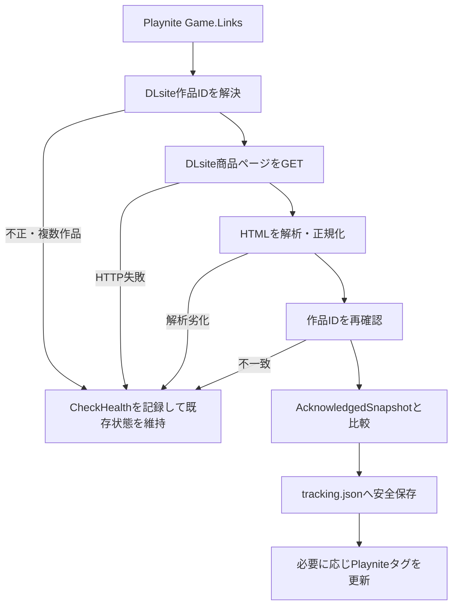

# DLsite Update Monitor

Playniteで管理しているDLsite作品について、DLsite側の**更新情報**と**ファイル容量**の変化を監視するPlayniteプラグインです。

> [!IMPORTANT]
> 本ツールはDLsiteおよびPlayniteの公式機能・公式サポートではない非公式ツールです。

## このツールが解決する問題

DLsite作品を多数管理していると、各商品ページを手作業で開いて配布状態の変化を確認するのは手間がかかります。DLsite Update MonitorはPlayniteの`Game.Links`に登録されたDLsite作品URLを読み取り、前回ユーザーが確認済みとした状態と現在のDLsite商品ページを比較します。

監視対象は次の2項目です。

- `更新情報`
- `ファイル容量`

初回取得は「更新あり」にせず、その時点の配布状態を監視基準（ベースライン）として保存します。以後、ユーザーが最後に「適用済み」または「無視」として確定した状態と比較して差分を検出します。

ネットワークエラー、HTTPエラー、解析劣化などが起きても、既存のベースラインや未処理の更新状態を消さないことを優先しています。

## 現在の状態

- 安定版として扱うVersion: **0.1.0**
- Playnite実機検証: **完了**
- Core自動テスト: **63ケース PASS**
- `.pext`インストール試験: **PASS**
- GitHub Release: **未作成（2026-09-14確認時点）**
- Git tag: **このリポジトリから確認できる公開Tagは未確認**
- GitHub Actions / CI: **未導入**

v0.1.0の詳細な検証記録と、検証済みパッケージ名・SHA-256は [RELEASE_STATUS.md](RELEASE_STATUS.md) を参照してください。

## 主な機能

- Playniteの`Game.Links`からDLsite作品IDを解決
- 全ゲームまたは選択ゲームの手動チェック
- DLsiteリンク診断
- 初回チェック時のベースライン作成
- `更新情報`の変更検出
- `ファイル容量`の変更検出
- 同一作品IDへのバッチ内重複通信の抑制
- 24時間を既定値とするメモリキャッシュ
- 更新状態のPlayniteタグ反映
- 「適用済み」「無視」「監視状態をリセット」操作
- `tracking.json`の一時ファイル経由保存、バックアップ、破損保護
- 429 / timeout / 一時ネットワークエラー / 5xxの再試行
- 不確定な解析結果や作品ID不一致時のfail-closed動作

## v0.1.0で行わないこと

- 自動ダウンロード
- 自動パッチ適用
- ローカルEXEのバージョン解析
- ローカルファイルのハッシュ比較
- Playnite起動時の自動チェック
- 定期自動チェック
- DLsite以外のストア監視
- DLsiteアカウントへのログインや認証情報の保存

このプラグインが判定しているのは、ローカルにインストール済みのゲーム本体の厳密なバージョンではなく、**DLsite商品ページ上の配布状態の変化**です。

## 動作環境

| 項目 | 現行v0.1.0 |
|---|---|
| OS | Windows（Playnite実機検証環境） |
| Playnite | 10.56 |
| プラグイン対象Framework | .NET Framework 4.6.2 |
| PlayniteSDK | 6.16.0 |
| HTML解析 | AngleSharp 0.9.9 |
| JSON | Newtonsoft.Json 10.0.3 |
| 開発・Coreテスト | .NET 8 SDK |
| ビルド環境 | Visual Studio 2022 / Build Tools + .NET Framework 4.6.2 Targeting Pack |

`Playnite.SDK.dll`、`AngleSharp.dll`、`Newtonsoft.Json.dll`はPlaynite本体側のランタイムを利用し、プラグインへ重複同梱しません。

ネットワーク通信はDLsiteの商品ページへのHTTP GETです。外部APIキーやアクセストークンは使用しません。

## インストール

### 一般利用者向け

2026-09-14確認時点ではGitHub Releaseが未作成のため、このリポジトリ上に一般配布用ダウンロードはありません。`.pext`はソースツリーへコミットしない方針です。

v0.1.0ではPlaynite Toolboxで生成した次のパッケージについて、インストール試験まで完了しています。

```text
DLsiteUpdateMonitor_334542c6-1f81-4cc5-afd5-e052b021d37e_0_1_0.pext
SHA-256: c84d8fbb3fb82e5d3d5c6bd974c153b33dd8437ff96f4447a4ed0c68c7a939bf
```

公開Releaseを作成する場合の手順は [docs/RELEASE.md](docs/RELEASE.md) を参照してください。

### 開発用インストール

まずリポジトリルートで検証ビルドを実行します。

```powershell
.\tools\Validate-Build.ps1
```

成功後、次のスクリプトで検証済み成果物`artifacts\plugin`を開発用拡張フォルダへ配置できます。

```powershell
.\tools\Install-Dev.ps1 -WhatIf
.\tools\Install-Dev.ps1
```

既定の配置先は次です。

```text
%APPDATA%\Playnite\Extensions\DLsiteUpdateMonitor\
```

既存フォルダがある場合、`artifacts\install-backups`へバックアップしてから置き換えます。配置後はPlayniteを再起動してください。

詳細は [BUILD.md](BUILD.md) を参照してください。

## 更新

v0.1.0の`.pext`インストール試験では、既存の監視状態が維持されることを確認済みです。更新時は念のためPlayniteまたはプラグインユーザーデータをバックアップしてから、新しい検証済みパッケージへ更新してください。

追跡データにはSchemaVersionがあります。現在のSchemaは`1`です。現在の実装より新しいSchemaの`tracking.json`を検出した場合は、**安全のためチェックと保存を無効化し、古い実装で上書きしません**。

将来Schema migrationを追加する場合は、互換性とロールバック手順を同時に文書化してください。

## アンインストール

プラグイン自身にはアンインストーラや追跡データ削除処理はありません。Playnite側で拡張機能を削除した際にプラグインユーザーデータが自動削除されるかどうかは、現行リポジトリからは**未確認**です。

完全削除が必要な場合は、先に必要なバックアップを取得し、Playniteが管理する本プラグインのユーザーデータディレクトリを確認したうえで、`tracking.json`、`tracking.backup.json`、破損保全ファイルなどの削除を検討してください。ユーザーデータの絶対パスはコードに固定されておらず、Playnite SDKの`GetPluginUserDataPath()`から取得します。

## 使用方法

### 1. DLsiteリンクを登録する

対象ゲームのPlaynite `Links` に、DLsiteの商品URLを登録します。v0.1.0はURLの`/product_id/<作品ID>`部分から作品IDを取得します。

対応する作品ID形式は、現在の実装では**英字2文字 + 6桁または8桁の数字**です。

1ゲームに異なる複数のDLsite作品IDが登録されている場合は`Ambiguous`として扱い、自動選択しません。

### 2. まずリンク診断を行う

Playniteのメインメニューから次を実行します。

```text
DLsite Update Monitor > DLsiteリンク診断
```

診断はリンクを読み取るだけで、タイトル・Notes・Links・Sources・ジャンルなどを変更しません。

### 3. 初回チェックを行う

ゲームの右クリックメニューから`今すぐ確認`、またはメインメニューから`全ゲームを今すぐ確認`を実行します。

未追跡のゲームでは、正常に取得できた最初の状態がベースラインになります。**初回観測だけで更新タグは付与されません。**

### 4. 2回目以降の差分を確認する

正常な候補スナップショットを、最後にユーザーが確認済みとした`AcknowledgedSnapshot`と比較します。

- 更新情報のみ変化 → `PendingUpdateInfo`
- ファイル容量のみ変化 → `PendingFileChange`
- 両方変化 → `PendingUpdateAndFileChange`
- 差分なし → `Clean`
- 安全に比較できない → 既存監視状態を維持してエラー/要確認扱い

### 5. 変更を処理する

ゲーム右クリックメニューから次を選べます。

- `現在の変更を適用済みにする`
- `現在の変更を無視する`
- `監視状態をリセット`

「適用済み」と「無視」はどちらも現在のスナップショットを次回比較の基準へ進めますが、履歴イベントは区別して記録します。

`監視状態をリセット`はベースラインと作品識別情報をクリアし、次回チェックを新規監視開始として扱います。追跡中のゲームのDLsite作品IDを別作品へ変更した場合は、**明示的にリセットするまで新しい作品へ切り替えません**。

## メニュー

### メインメニュー

| メニュー | 動作 |
|---|---|
| 全ゲームを今すぐ確認 | キャッシュを使わず全ゲームを確認 |
| キャッシュを利用して確認 | 有効なメモリキャッシュを利用して全ゲームを確認 |
| DLsiteリンク診断 | リンクの正常 / なし / 不正 / 複数作品を集計 |
| キャッシュをクリア | プロセス内のスナップショットキャッシュを消去 |

### ゲーム右クリックメニュー

| メニュー | 動作 |
|---|---|
| 今すぐ確認 | 選択ゲームをキャッシュなしで確認 |
| DLsiteページを開く | 1ゲーム選択時に登録済みDLsite URLを開く |
| 現在の変更を適用済みにする | 現在状態を確認済み基準へ進める |
| 現在の変更を無視する | 現在状態を無視済みとして確認済み基準へ進める |
| 監視状態をリセット | 作品識別情報とベースラインをクリア |

## Playniteタグ

設定`更新状態をPlayniteタグへ反映`が有効な場合、プラグインが管理するタグだけを変更します。

| 監視状態 | タグ |
|---|---|
| `Clean` / `Uninitialized` | なし |
| `PendingUpdateInfo` | `[DLsite更新] 更新あり` |
| `PendingFileChange` | `[DLsite更新] 配布物変更` |
| `PendingUpdateAndFileChange` | `[DLsite更新] 更新あり` |

タグ連携を無効にした場合も、`[DLsite更新] `で始まるプラグイン管理タグだけを除去し、ユーザーの無関係なタグには触れません。

## 設定

| 設定 | 既定値 | 設定可能値 | 用途 |
|---|---:|---:|---|
| リクエスト間隔 | 2秒 | 1〜60秒 | DLsiteへのリクエスト開始間隔 |
| タイムアウト | 20秒 | 5〜120秒 | 1試行あたりのHTTP timeout |
| リトライ回数 | 2回 | 0〜5回 | 一時エラー時の追加試行回数 |
| キャッシュ | 24時間 | 1〜168時間 | 正常なリモート観測のメモリキャッシュTTL |
| ゲームごとの履歴上限 | 50件 | 10〜500件 | `tracking.json`内の履歴保持件数 |
| 更新状態をPlayniteタグへ反映 | ON | ON / OFF | プラグイン管理タグの同期 |

設定はPlayniteのプラグイン設定機構で保存します。設定ファイルの物理パスはこのリポジトリ内では固定していません。

## 内部処理の概要



詳細は [DEVELOPMENT.md](DEVELOPMENT.md) と [docs/ARCHITECTURE.md](docs/ARCHITECTURE.md) を参照してください。

## データと状態

追跡状態はPlaynite SDKが返すプラグインユーザーデータディレクトリに保存します。

主なファイル:

- `tracking.json` — 現在の追跡データ
- `tracking.backup.json` — 置換前のバックアップ
- `tracking.tmp` — 保存時の一時ファイル
- `tracking.json.corrupt-YYYYMMDD-HHMMSS...` — 読み取り不能ファイルを保全した場合に作成される可能性があるファイル

主なゲーム単位の状態:

- 登録URL / 要求作品ID / 解決URL / 解決作品ID
- `MonitoringState`
- `LastCheckHealth`
- `AcknowledgedSnapshot`
- `CurrentSnapshot`
- `LastObservation`
- 初回・最終試行・最終成功時刻
- 最終エラー
- 変更履歴

保存時は`tracking.tmp`へ書き、直ちに再読み込みして検証した後に本ファイルを置き換えます。

## エラー・再試行・復旧

HTTPは原則として次のように扱います。

| 状況 | 挙動 |
|---|---|
| 429 | 再試行。`Retry-After`があれば優先 |
| timeout | 再試行 |
| 一時ネットワークエラー | 再試行 |
| 5xx | 再試行 |
| 403 | 原則再試行しない |
| 404 / 410 | `ProductUnavailable`、原則再試行しない |
| HTTP 200の利用不可ページ | `.error_box_work`を検出して`ProductUnavailable` |
| 解析不能 / 比較不能 | `ParseError`または`ParseDegraded`。既存状態を進めない |
| 別作品へのリダイレクト | `RedirectedToDifferentProduct`。ベースラインを流用しない |
| 登録リンクの作品ID変更 | `LinkError`。明示リセットまで受け入れない |

Playnite終了時に更新処理が実行中の場合、競合する最終保存を行うより、処理中に行った途中保存を優先して最終保存をスキップします。

詳細な対処方法は [docs/TROUBLESHOOTING.md](docs/TROUBLESHOOTING.md) を参照してください。

## セキュリティとプライバシー

- API Key、Access Token、Refresh Token、パスワードを使用・保存しません。
- DLsiteへのGETでは`locale=ja_JP`と`loginchecked=1`の固定Cookieを設定します。ユーザーのログインセッションCookieを保存する実装ではありません。
- 追跡データには商品URL、作品ID、取得した商品名、更新情報、ファイル容量、診断情報が保存されます。
- ログには例外やURLが出力される可能性があります。問題報告時は共有前に内容を確認してください。
- 診断処理はPlayniteゲームメタデータを変更しません。
- タグ操作はプラグイン自身の`[DLsite更新] `タグだけを対象にします。

## 制限事項・未確認事項

- DLsiteの商品ページHTML構造が変わると解析できなくなる可能性があります。
- v0.1.0の対応作品IDは英字2文字 + 6桁または8桁の数字です。
- 自動チェック・自動ダウンロード・自動パッチ適用はありません。
- Coreは自動テストされていますが、Playnite SDKとのUI統合は実機スモークテストが中心です。
- CI/GitHub Actionsは未導入です。
- GitHub Release/Tagは現時点で未作成・未確認です。
- Playniteによるアンインストール時のユーザーデータ削除挙動は、このリポジトリだけでは未確認です。

## トラブルシューティング

代表例:

- **初回チェックで更新タグが付いた** → 正常仕様ではありません。処理を中止し、`tracking.json`とログを保全してください。
- **403 / 429 / timeout** → 既存のベースラインや保留状態は維持される設計です。通信状況を確認し、時間を置いて再実行してください。
- **別の作品IDへリンクを変更したらLinkError** → 仕様です。作品を切り替える意図がある場合だけ`監視状態をリセット`してください。
- **追跡JSONが壊れた** → 有効な`tracking.backup.json`があれば自動復旧を試みます。両方読めない場合は破損ファイルを保全して新規DBを作成します。
- **プラグインが読み込まれない** → [BUILD.md](BUILD.md) の成果物と依存DLL方針を確認してください。

詳細は [docs/TROUBLESHOOTING.md](docs/TROUBLESHOOTING.md) を参照してください。

## ビルド・テスト

Windowsで一括検証:

```powershell
.\tools\Validate-Build.ps1
```

または:

```cmd
tools\Validate-Build.cmd
```

このゲートは.NET 8 SDK / .NET Framework 4.6.2 Targeting Pack、Coreテスト63ケース、`net462`プラグインビルド、必須成果物、禁止ランタイムDLLの非同梱、`extension.yaml`の基本整合性を確認します。

実機確認は [docs/SMOKE_TEST.md](docs/SMOKE_TEST.md) のGate A〜Fを順番に実施してください。

## ファイル・ディレクトリ構成

```text
DLsite-Update-Monitor/
├─ src/
│  ├─ DLsiteUpdateMonitor.Core/        # HTTP・解析・比較・状態・永続化
│  └─ DLsiteUpdateMonitor.Plugin/      # Playnite統合・UI・タグ・設定
├─ tests/
│  └─ DLsiteUpdateMonitor.Core.Tests/  # Core自動テスト
├─ tools/                              # 検証・開発インストール・Release作成
├─ docs/                               # アーキテクチャ・Release・障害対応・実機テスト
├─ README.md                           # 利用者向け主要ドキュメント
├─ DEVELOPMENT.md                      # 開発・保守・引き継ぎ
├─ CHANGELOG.md                        # バージョン履歴
├─ BUILD.md                            # ビルドと検証手順
├─ IMPLEMENTATION_NOTES.md             # 安全設計の既存詳細メモ
└─ RELEASE_STATUS.md                   # v0.1.0最終検証記録
```

## 開発者向け資料

- [DEVELOPMENT.md](DEVELOPMENT.md) — 開発継続・保守・AI引き継ぎの入口
- [CHANGELOG.md](CHANGELOG.md) — バージョン履歴
- [docs/ARCHITECTURE.md](docs/ARCHITECTURE.md) — コンポーネント・データフロー・状態設計
- [docs/RELEASE.md](docs/RELEASE.md) — リリース手順とチェックリスト
- [docs/TROUBLESHOOTING.md](docs/TROUBLESHOOTING.md) — 詳細な診断と復旧
- [BUILD.md](BUILD.md) — ビルド・自動検証
- [IMPLEMENTATION_NOTES.md](IMPLEMENTATION_NOTES.md) — 実装上の重要ルール
- [docs/SMOKE_TEST.md](docs/SMOKE_TEST.md) — Playnite実機スモークテスト
- [RELEASE_STATUS.md](RELEASE_STATUS.md) — v0.1.0の検証記録

## License

**未設定です。**

ライセンスが明示されるまでは、利用・再配布・派生物の扱いを勝手に推測しないでください。
