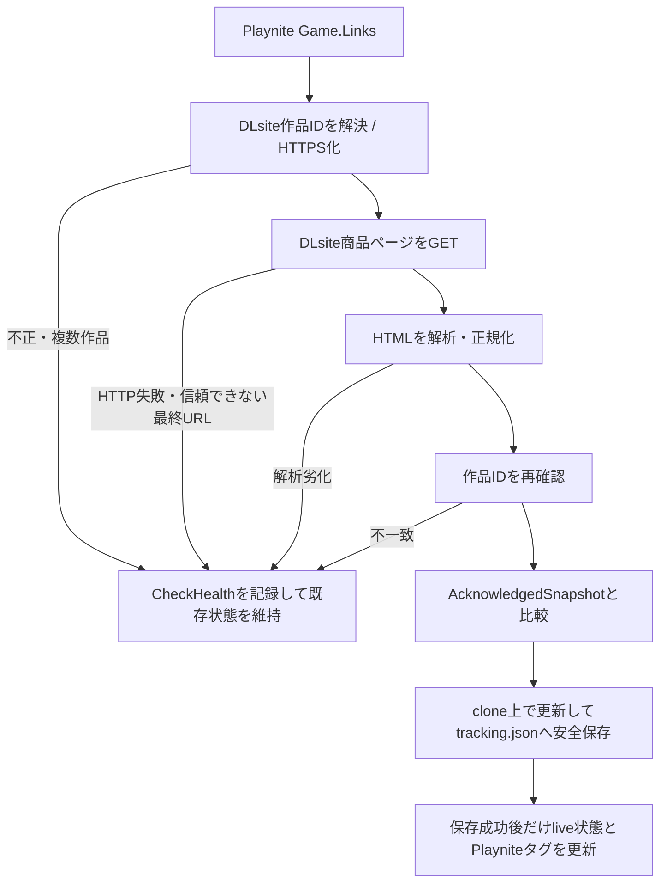

# DLsite Update Monitor

Playniteで管理しているDLsite作品について、DLsite側の**更新情報**と**ファイル容量**の変化を監視するPlayniteプラグインです。

> [!IMPORTANT]
> 本ツールはDLsiteおよびPlayniteの公式機能・公式サポートではない非公式ツールです。

## このツールが解決する問題

DLsite作品を多数管理していると、各商品ページを手作業で開いて配布状態の変化を確認するのは手間がかかります。DLsite Update MonitorはPlayniteの`Game.Links`に登録されたDLsite作品URLを読み取り、前回ユーザーが確認済みとした状態と現在のDLsite商品ページを比較します。

監視対象は次の2項目です。

- `更新情報`
- `ファイル容量`

初回取得は「更新あり」にせず、その時点の配布状態を監視基準（ベースライン）として保存します。以後、ユーザーが最後に「適用済み」または「無視」として確定した状態と比較して差分を検出します。

ネットワークエラー、HTTPエラー、解析劣化などが起きても、既存のベースラインや未処理の更新状態を消さないことを優先しています。

## 現在の状態

- 現在の正式Version: **1.2.0**
- GitHub Release: **v1.2.0 公開済み**
- 最新公開Git tag: **`v1.2.0`**
- 開発状態: **v1.2.0公開済み。次の変更はUnreleasedとして管理**
- Playnite実機検証基準: **10.56**
- v1.2.0 Core自動テスト / Static validation: **PASS（GitHub Actions）**
- v1.2.0 Windows Plugin build / payload境界検証: **PASS（GitHub Actions）**
- v1.2.0 Playnite 10.56実機確認: **Update Center + automatic check Gate H + final `.pext` install PASS**
- v1.2.0 最終`.pext`インストール試験: **PASS**
- Tracking Schema: **1**
- GitHub Actions / CI: **導入済み**
- License: **MIT**

v1.2.0は、v1.1.0の安全設計を維持したままUpdate Centerと既定OFFのautomatic checkを追加したbackward-compatible feature releaseです。Update Center起動・theme integration・Settings表示・automatic check Gate H・最終`.pext` installまでPlaynite 10.56実機で確認済みです。

現在公開中のv1.2.0パッケージ:

```text
DLsiteUpdateMonitor_334542c6-1f81-4cc5-afd5-e052b021d37e_1_2_0.pext
SHA-256: 59a8456ff48036ad8d0dd47a69d2f6a9b7065959a1f94aadf49af073081cbfba
```

v1.2.0の変更点と検証内容は [docs/RELEASE_NOTES_1.2.0.md](docs/RELEASE_NOTES_1.2.0.md) を参照してください。v1.1.0の記録も [docs/RELEASE_NOTES_1.1.0.md](docs/RELEASE_NOTES_1.1.0.md) に残しています。v0.1.0の詳細な検証証跡と旧パッケージSHA-256は [RELEASE_STATUS.md](RELEASE_STATUS.md) に保存しています。

## 主な機能

- Playniteの`Game.Links`からDLsite作品IDを解決
- HTTPのDLsiteリンクをHTTPSへ正規化し、各redirect先を送信前にHTTPS + DLsite hostか検証
- Update Centerで追跡中ゲームの更新・要確認状態を一覧表示
- Update Centerで確認済み基準と現在値の「更新情報」「ファイル容量」を左右に並べた差分表示
- Update Centerから検索・状態フィルタ・複数選択・適用済み/無視/再確認
- 全ゲームまたは選択ゲームの手動チェック
- 追跡済みゲームの定期自動チェック（既定OFF）
- エラー/要確認だったゲームだけを強制再確認
- DLsiteリンク診断（問題ゲーム名・理由・曖昧な候補ProductIdを表示）
- 初回チェック時のベースライン作成
- `更新情報`の変更検出
- `ファイル容量`の変更検出
- 同一作品IDへのバッチ内重複通信の抑制
- 24時間を既定値とするメモリキャッシュ
- 更新状態のPlayniteタグ反映
- tracking JSONの確定状態からPlayniteタグを再同期する修復操作
- 1ゲーム単位の監視詳細表示（Baseline / Current / LastObservation / Health / Error / History）
- 「適用済み」「無視」「監視状態をリセット」操作
- Playniteから削除済みゲームに対応する孤立tracking recordの確認付き整理
- `tracking.json`の一時ファイル経由保存、バックアップ、破損保護
- backup復旧後も正常backupを失わない保存処理
- 429 / timeout / 一時ネットワークエラー / 5xxの再試行
- 長い`Retry-After`は同一操作内で待ち続けず、後続操作へロックを返す
- HTTP redirectは自動追跡せず、各`Location`を検証してから次のGETを送信
- HTTPレスポンス本文にサイズ上限を設け、異常に大きい応答を拒否
- 予期しない4xxを無駄に再試行しない処理
- 不確定な解析結果や作品ID不一致時のfail-closed動作
- GitHub ActionsによるCoreテスト、Windows Plugin build、payload境界検証

## 現在も行わないこと

- 自動ダウンロード
- 自動パッチ適用
- ローカルEXEのバージョン解析
- ローカルファイルのハッシュ比較
- 未追跡ゲームの自動監視開始
- DLsite以外のストア監視
- DLsiteアカウントへのログインや認証情報の保存

このプラグインが判定しているのは、ローカルにインストール済みのゲーム本体の厳密なバージョンではなく、**DLsite商品ページ上の配布状態の変化**です。

## 動作環境

| 項目 | 現行 |
|---|---|
| OS | Windows（Playnite実機検証環境） |
| Playnite | 10.56 |
| プラグイン対象Framework | .NET Framework 4.6.2 |
| PlayniteSDK | 6.16.0 |
| HTML解析 | AngleSharp 0.9.9 |
| JSON | Newtonsoft.Json 10.0.3 |
| 開発・Coreテスト | .NET 8 SDK |
| ビルド環境 | Visual Studio 2022 / Build Tools + .NET Framework 4.6.2 Targeting Pack |

`Playnite.SDK.dll`、`AngleSharp.dll`、`Newtonsoft.Json.dll`はPlaynite本体側のランタイムを利用し、プラグインへ重複同梱しません。

ネットワーク通信はDLsiteの商品ページへのHTTP GETです。登録された`http://`のDLsiteリンクはHTTPSへ正規化します。redirectは自動追跡せず、次のGETを送る前に各`Location`がHTTPSかつ`dlsite.com` / `*.dlsite.com`であることを検証します。外部APIキーやアクセストークンは使用しません。

## インストール

### 一般利用者向け

正式公開版を使う場合は [v1.2.0 Release](https://github.com/Hoyomaru/DLsite-Update-Monitor/releases/tag/v1.2.0) のAssetsから次の`.pext`をダウンロードし、Playniteへインストールしてください。

```text
DLsiteUpdateMonitor_334542c6-1f81-4cc5-afd5-e052b021d37e_1_2_0.pext
```

公開AssetのSHA-256:

```text
59a8456ff48036ad8d0dd47a69d2f6a9b7065959a1f94aadf49af073081cbfba
```

同じReleaseに添付されている`SHA256SUMS.txt`も確認用に利用できます。

`.pext`はソースツリーへコミットせず、GitHub Releasesで配布します。

> [!NOTE]
> `main`には今後Unreleasedの変更が入る可能性があります。安定版を利用する場合はGitHub Releaseのv1.2.0配布物を使用してください。

Release作成手順は [docs/RELEASE.md](docs/RELEASE.md) を参照してください。

### 開発用・実機テスト用インストール

ローカルで検証ビルドする場合はリポジトリルートで実行します。

```powershell
.\tools\Validate-Build.ps1
```

成功後、次のスクリプトで検証済み成果物`artifacts\plugin`を開発用拡張フォルダへ配置できます。

```powershell
.\tools\Install-Dev.ps1 -WhatIf
.\tools\Install-Dev.ps1
```

GitHub Actionsの実機テスト候補では、Windows build jobが`DLsiteUpdateMonitor-smoke-<commit SHA>` Artifactを生成します。このArtifactを展開して同じ開発用拡張フォルダへ配置すれば、CIで実際にbuild・検証したバイナリをそのままSmoke Testできます。

既定の配置先は次です。

```text
%APPDATA%\Playnite\Extensions\DLsiteUpdateMonitor\
```

既存フォルダがある場合はバックアップしてから置き換え、配置後にPlayniteを再起動してください。

詳細は [BUILD.md](BUILD.md) を参照してください。

## 更新

公開v1.0.0、v1.1.0、v1.2.0はいずれもTracking Schema `1`を使用しています。これらのVersion間の更新でTracking Schema migrationは発生しません。

更新時は念のためPlayniteまたはプラグインユーザーデータをバックアップしてから、新しい検証済みパッケージへ更新してください。

追跡データにはSchemaVersionがあります。現在の実装より新しいSchemaの`tracking.json`を検出した場合は、**安全のためチェックと保存を無効化し、古い実装で上書きしません**。

将来Schema migrationを追加する場合は、互換性とロールバック手順を同時に文書化してください。

## アンインストール

プラグイン自身にはアンインストーラや追跡データ全削除処理はありません。Playnite側で拡張機能を削除した際にプラグインユーザーデータが自動削除されるかどうかは、現行リポジトリからは**未確認**です。

完全削除が必要な場合は、先に必要なバックアップを取得し、Playniteが管理する本プラグインのユーザーデータディレクトリを確認したうえで、`tracking.json`、`tracking.backup.json`、破損保全ファイルなどの削除を検討してください。ユーザーデータの絶対パスはコードに固定されておらず、Playnite SDKの`GetPluginUserDataPath()`から取得します。

なお、Playniteから個別ゲームを削除した結果として残ったtracking recordは、メインメニューの`孤立した追跡データを整理`で確認後に削除できます。

## 使用方法

### 1. DLsiteリンクを登録する

対象ゲームのPlaynite `Links` に、DLsiteの商品URLを登録します。現在の実装はURLの`/product_id/<作品ID>`部分から作品IDを取得します。

対応する作品ID形式は、現在の実装では**英字2文字 + 6桁または8桁の数字**です。

1ゲームに異なる複数のDLsite作品IDが登録されている場合は`Ambiguous`として扱い、自動選択しません。

### 2. Update Centerを開く

Playniteのメインメニューから次を開けます。

```text
DLsite Update Monitor > Update Centerを開く
```

Update Centerでは、追跡済みゲームを一覧で確認できます。

- ゲーム名 / 作品IDで検索
- 未処理の変更 / エラー・要確認 / 変更なし / 未初期化で絞り込み
- 複数ゲームを選択して **適用済みにする** / **無視する**
- 選択ゲームを再確認
- エラー・要確認ゲームをまとめて再確認
- 1ゲーム選択時、確認済み基準と現在値の更新情報・ファイル容量を左右比較
- 1ゲームの監視詳細表示
- tracking状態からPlayniteタグを再同期
- DLsiteページを開く

一覧は内部状態名をそのまま見せず、`更新情報`、`配布物`、`確認が必要`などユーザーが次の操作を判断しやすい表現を使います。Update Center上部には、自動チェックのON/OFFと設定間隔も表示します。

### 自動チェック

プラグイン設定画面の最上部にある **自動チェック（既定OFF）** から有効化できます。設定画面は縦スクロール可能です。

**追跡中のゲームを自動チェックする** を有効にすると、既にtracking recordを持つゲームだけを定期確認します。既定値は**OFF**です。

- 既定間隔: **24時間**
- 設定可能: **1～168時間**
- Playnite起動直後は約2分待ってから判定
- その後は15分ごとに期限超過レコードの有無だけを確認
- 通常は各ゲームの `LastAttemptAtUtc` が設定間隔より古い場合だけ対象
- DLsiteが`Retry-After`を返した場合は`RetryNotBeforeUtc`を保存し、その時刻までは待機せずschedulerへ返す。期限後は通常間隔より優先して次のpollで再確認
- 自動チェックはキャッシュに依存せず、期限到達時にリモートを再確認
- 手動チェックや状態変更が実行中なら、その回は開始せず次回判定へ延期
- 完了MessageBoxやエラーMessageBoxは表示せず、結果はtracking / Playniteタグ / Update Centerへ反映
- 自動チェックによって未追跡ゲームを新規登録することはありません
- 追跡recordが残っていても、DLsiteリンク自体を削除したゲームはscheduler対象から外します

最初のベースライン作成は、従来どおり`今すぐ確認`または`全ゲームを今すぐ確認`で明示的に開始します。

### 3. まずリンク診断を行う

Playniteのメインメニューから次を実行します。

```text
DLsite Update Monitor > DLsiteリンク診断
```

診断はリンクを読み取るだけで、タイトル・Notes・Links・Sources・ジャンルなどを変更しません。問題がある場合はゲーム名と理由を表示し、曖昧なリンクでは候補ProductIdも表示します。

### 4. 初回チェックを行う

ゲームの右クリックメニューから`今すぐ確認`、またはメインメニューから`全ゲームを今すぐ確認`を実行します。

未追跡のゲームでは、正常に取得できた最初の状態がベースラインになります。**初回観測だけで更新タグは付与されません。**

### 5. 2回目以降の差分を確認する

正常な候補スナップショットを、最後にユーザーが確認済みとした`AcknowledgedSnapshot`と比較します。

- 更新情報のみ変化 → `PendingUpdateInfo`
- ファイル容量のみ変化 → `PendingFileChange`
- 両方変化 → `PendingUpdateAndFileChange`
- 差分なし → `Clean`
- 安全に比較できない → 既存監視状態を維持してエラー/要確認扱い

Update Centerで1ゲームだけ選択すると、確認済み基準と現在値の`更新情報`・`ファイル容量`を左右に並べた差分ビューを確認できます。比較不能な観測を変更ありとして誤表示せず、既存の比較ルールと同じ安全条件を使います。

`監視詳細を表示`では、確認済み基準、現在の比較可能状態、直近観測、CheckHealth、最終エラー、再試行可能時刻、最近の履歴を1ゲーム単位で確認できます。

### 6. エラーだけを再確認する

一時的な通信失敗などが解消した後は、メインメニューの`エラー/要確認のゲームを再確認`を使えます。`LastCheckHealth`が`Healthy`でも`NeverChecked`でもない追跡済みゲームだけを対象に、キャッシュを使わず再確認します。

### 7. 変更を処理する

ゲーム右クリックメニューから次を選べます。

- `現在の変更を適用済みにする`
- `現在の変更を無視する`
- `監視状態をリセット`

「適用済み」と「無視」はどちらも現在のスナップショットを次回比較の基準へ進めますが、履歴イベントは区別して記録します。

`監視状態をリセット`はベースラインと作品識別情報をクリアし、次回チェックを新規監視開始として扱います。追跡中のゲームのDLsite作品IDを別作品へ変更した場合は、**明示的にリセットするまで新しい作品へ切り替えません**。

## メニュー

### メインメニュー

| メニュー | 動作 |
|---|---|
| Update Centerを開く | 追跡中ゲームの更新・要確認状態を一覧表示し、検索・絞り込み・一括操作 |
| 設定を開く | DLsite Update Monitorの設定画面を直接開く |
| 全ゲームを今すぐ確認 | キャッシュを使わず全ゲームを確認 |
| キャッシュを利用して確認 | 有効なメモリキャッシュを利用して全ゲームを確認 |
| エラー/要確認のゲームを再確認 | 最後のCheckHealthが異常な追跡済みゲームだけを強制再確認 |
| DLsiteリンク診断 | リンク状態を集計し、問題ゲーム名・理由・候補ProductIdを表示 |
| 孤立した追跡データを整理 | Playniteに存在しないGameIdのtracking recordをPreview・確認後に削除 |
| タグを再同期 | tracking JSONの確定状態からPlugin管理タグを再適用し、部分失敗後の表示ずれを修復 |
| キャッシュをクリア | プロセス内のスナップショットキャッシュを消去 |

### ゲーム右クリックメニュー

| メニュー | 動作 |
|---|---|
| 今すぐ確認 | 選択ゲームをキャッシュなしで確認 |
| 監視詳細を表示 | 1ゲームのBaseline / Current / Observation / Health / Error / Historyを表示 |
| DLsiteページを開く | 1ゲーム選択時に登録済みDLsite URLをHTTPSとして開く |
| 現在の変更を適用済みにする | 現在状態を確認済み基準へ進める |
| 現在の変更を無視する | 現在状態を無視済みとして確認済み基準へ進める |
| 監視状態をリセット | 作品識別情報とベースラインをクリア |

## Playniteタグ

設定`更新状態をPlayniteタグへ反映`が有効な場合、プラグインが所有する次の**2つの正確なタグ名だけ**を管理します。

- `[DLsite更新] 更新あり`
- `[DLsite更新] 配布物変更`

| 監視状態 | タグ |
|---|---|
| `Clean` / `Uninitialized` | なし |
| `PendingUpdateInfo` | `[DLsite更新] 更新あり` |
| `PendingFileChange` | `[DLsite更新] 配布物変更` |
| `PendingUpdateAndFileChange` | **上記2タグの両方** |

`[DLsite更新] 自分用メモ`のように同じprefixを使うユーザー作成タグは、プラグイン所有とはみなしません。

## 設定

| 設定 | 既定値 | 設定可能値 | 用途 |
|---|---:|---:|---|
| リクエスト間隔 | 2秒 | 1〜60秒 | DLsiteへのリクエスト開始間隔 |
| タイムアウト | 20秒 | 5〜120秒 | 1試行あたりのHTTP timeout |
| リトライ回数 | 2回 | 0〜5回 | 一時エラー時の追加試行回数 |
| キャッシュ | 24時間 | 1〜168時間 | 正常なリモート観測のメモリキャッシュTTL |
| ゲームごとの履歴上限 | 50件 | 10〜500件 | `tracking.json`内の履歴保持件数 |
| 更新状態をPlayniteタグへ反映 | ON | ON / OFF | プラグイン管理タグの同期 |
| 追跡中のゲームを自動チェックする | OFF | ON / OFF | 期限到達した追跡済みゲームだけを静かに再確認 |
| 自動チェック間隔 | 24時間 | 1〜168時間 | 各ゲームの最終試行から次の自動確認までの間隔 |

設定はPlayniteのプラグイン設定機構で保存します。保存済み設定が読み込み可能でも数値範囲外だった場合は、Plugin起動を失敗させず、その項目を安全な既定値へ補正します。

## 内部処理の概要


```mermaid
flowchart TD
    A[Playnite Game.Links] --> B[DLsite作品IDを解決 / HTTPS化]
    B -->|不正・複数作品| E[CheckHealthを記録して既存状態を維持]
    B --> C[DLsite商品ページをGET]
    C -->|HTTP失敗・信頼できない最終URL| E
    C --> D[HTMLを解析・正規化]
    D -->|解析劣化| E
    D --> F[作品IDを再確認]
    F -->|不一致| E
    F --> G[AcknowledgedSnapshotと比較]
    G --> H[clone上で更新してtracking.jsonへ安全保存]
    H --> I[保存成功後だけlive状態とPlayniteタグを更新]
```

詳細は [DEVELOPMENT.md](DEVELOPMENT.md) と [docs/ARCHITECTURE.md](docs/ARCHITECTURE.md) を参照してください。

## データと状態

追跡状態はPlaynite SDKが返すプラグインユーザーデータディレクトリに保存します。

主なファイル:

- `tracking.json` — 現在の追跡データ
- `tracking.backup.json` — 置換前のバックアップ
- `tracking.tmp` — 保存時の一時ファイル
- `tracking.json.corrupt-YYYYMMDD-HHMMSS...` — 読み取り不能ファイルを保全した場合に作成される可能性があるファイル

主なゲーム単位の状態:

- 登録URL / 要求作品ID / 解決URL / 解決作品ID
- `MonitoringState`
- `LastCheckHealth`
- `AcknowledgedSnapshot`
- `CurrentSnapshot`
- `LastObservation`
- 初回・最終試行・最終成功時刻
- 最終エラー
- 変更履歴

保存時は`tracking.tmp`へ書き、直ちに再読み込みして検証した後に本ファイルを置き換えます。状態変更操作は作業用cloneへ適用し、保存に成功したあとだけlive状態へ昇格します。

primaryが破損して正常backupから復旧した場合は、次回保存で正常backupを破損primaryによって上書きしないよう、破損primaryだけを`.corrupt-*`へ退避してから保存します。

## エラー・再試行・復旧

HTTPは原則として次のように扱います。

| 状況 | 挙動 |
|---|---|
| 429 | 再試行。`Retry-After`があれば優先 |
| timeout | 再試行 |
| 一時ネットワークエラー | 再試行 |
| 5xx | 再試行 |
| 403 | 原則再試行しない |
| 404 / 410 | `ProductUnavailable`、原則再試行しない |
| その他4xx | client error、原則再試行しない |
| HTTPS以外 / DLsite以外へ解決 | 信頼できない取得先として拒否 |
| HTTP 200の利用不可ページ | `.error_box_work`を検出して`ProductUnavailable` |
| 解析不能 / 比較不能 | `ParseError`または`ParseDegraded`。既存状態を進めない |
| 別作品へのリダイレクト | `RedirectedToDifferentProduct`。ベースラインを流用しない |
| 登録リンクの作品ID変更 | `LinkError`。明示リセットまで受け入れない |

同じProductIdを複数ゲームが参照するバッチでは、Remote Productに共通する失敗だけを共有します。あるゲーム固有の旧ProductId不一致など`LocalRecord`失敗は、別ゲームへ伝播させません。

Playnite終了時に更新処理が実行中の場合、競合する最終保存を行うより、処理中に行った途中保存を優先して最終保存をスキップします。

詳細な対処方法は [docs/TROUBLESHOOTING.md](docs/TROUBLESHOOTING.md) を参照してください。

## セキュリティとプライバシー

- API Key、Access Token、Refresh Token、パスワードを使用・保存しません。
- DLsiteへのGETでは`locale=ja_JP`と`loginchecked=1`の固定Cookieを設定します。ユーザーのログインセッションCookieを保存する実装ではありません。
- DLsite URLはHTTP(S)だけを対象とし、HTTPはHTTPSへ正規化します。最終取得先もHTTPS + DLsite hostを要求します。
- tracking JSONの読み込みには深い入れ子による過剰処理を抑える`MaxDepth`を設定しています。
- 追跡データには商品URL、作品ID、取得した商品名、更新情報、ファイル容量、診断情報が保存されます。
- ログには例外やURLが出力される可能性があります。問題報告時は共有前に内容を確認してください。
- 診断処理はPlayniteゲームメタデータを変更しません。
- タグ操作は上記2つの正確なPlugin所有タグだけを対象にします。

## 制限事項・未確認事項

- DLsiteの商品ページHTML構造が変わると解析できなくなる可能性があります。
- 対応作品IDは英字2文字 + 6桁または8桁の数字です。
- 自動チェックは追跡済みゲームだけを対象とし、未追跡ゲームの自動登録は行いません。
- 自動ダウンロード・自動パッチ適用はありません。
- CoreとWindows Plugin buildはGitHub Actionsで自動検証しますが、Playnite SDKとの実際のUI・DB統合は実機Smoke Testが必要です。
- v1.1.0はPlaynite 10.56でSmoke Test Gate A〜G、最終Artifact短縮Smoke、`.pext`インストール試験まで完了しています。
- Playniteによるアンインストール時のユーザーデータ削除挙動は、このリポジトリだけでは未確認です。

## トラブルシューティング

代表例:

- **初回チェックで更新タグが付いた** → 正常仕様ではありません。処理を中止し、`tracking.json`とログを保全してください。
- **403 / 429 / timeout** → 既存のベースラインや保留状態は維持される設計です。通信状況を確認し、`エラー/要確認のゲームを再確認`を利用できます。
- **自動チェックが動かない** → 設定がONか、対象ゲームが既に追跡済みか、最終試行から設定時間を超えているかを確認してください。起動直後は約2分、手動処理中は次の15分判定まで延期されます。
- **別の作品IDへリンクを変更したらLinkError** → 仕様です。作品を切り替える意図がある場合だけ`監視状態をリセット`してください。
- **追跡JSONが壊れた** → 有効な`tracking.backup.json`があれば自動復旧を試みます。両方読めない場合は破損ファイルを保全して新規DBを作成します。
- **削除済みゲームのrecordが残る** → `孤立した追跡データを整理`で候補を確認してから削除できます。
- **プラグインが読み込まれない** → [BUILD.md](BUILD.md) の成果物と依存DLL方針を確認してください。

詳細は [docs/TROUBLESHOOTING.md](docs/TROUBLESHOOTING.md) を参照してください。

## ビルド・テスト

Windowsで一括検証:

```powershell
.\tools\Validate-Build.ps1
```

または:

```cmd
tools\Validate-Build.cmd
```

GitHub Actionsでは、Coreテスト + Static validationと、Windows上の`net462` Plugin build + payload境界検証を自動実行します。Windows jobは実機テスト用`DLsiteUpdateMonitor-smoke-<commit SHA>` Artifactも生成します。現在のUnreleased以降では、MIT `LICENSE`も検証済みpayloadへ同梱します。

v1.1.0ではCoreテスト **72ケース**、Static validation、Windows Plugin build / payload境界検証がPASSしています。Playnite 10.56のSmoke Test Gate A〜G、最終Artifact短縮Smoke、`.pext`インストール試験も完了しています。

実機確認手順は [docs/SMOKE_TEST.md](docs/SMOKE_TEST.md) のGate A〜Gを参照してください。

## ファイル・ディレクトリ構成

```text
DLsite-Update-Monitor/
├─ .github/workflows/                   # Core / Windows Plugin CI
├─ src/
│  ├─ DLsiteUpdateMonitor.Core/        # HTTP・解析・比較・状態・永続化
│  └─ DLsiteUpdateMonitor.Plugin/      # Playnite統合・UI・タグ・設定
├─ tests/
│  └─ DLsiteUpdateMonitor.Core.Tests/  # Core自動テスト
├─ tools/                              # 検証・開発インストール・Release作成
├─ docs/                               # アーキテクチャ・Release・障害対応・実機テスト
├─ LICENSE                             # MIT License
├─ README.md                           # 利用者向け主要ドキュメント
├─ DEVELOPMENT.md                      # 開発・保守・引き継ぎ
├─ CHANGELOG.md                        # バージョン履歴
├─ BUILD.md                            # ビルドと検証手順
├─ IMPLEMENTATION_NOTES.md             # 旧リンク互換の安全設計インデックス
└─ RELEASE_STATUS.md                   # v0.1.0正式公開前の検証証跡
```

## 開発者向け資料

- [DEVELOPMENT.md](DEVELOPMENT.md) — 開発継続・保守・AI引き継ぎの入口
- [CHANGELOG.md](CHANGELOG.md) — バージョン履歴
- [docs/ARCHITECTURE.md](docs/ARCHITECTURE.md) — コンポーネント・データフロー・状態設計
- [docs/RELEASE.md](docs/RELEASE.md) — リリース手順とチェックリスト
- [docs/RELEASE_NOTES_1.1.0.md](docs/RELEASE_NOTES_1.1.0.md) — v1.1.0 公開Release記録
- [docs/RELEASE_NOTES_1.0.0.md](docs/RELEASE_NOTES_1.0.0.md) — v1.0.0 公開Release記録
- [docs/TROUBLESHOOTING.md](docs/TROUBLESHOOTING.md) — 詳細な診断と復旧
- [BUILD.md](BUILD.md) — ビルド・自動検証
- [IMPLEMENTATION_NOTES.md](IMPLEMENTATION_NOTES.md) — 旧リンク互換インデックス
- [docs/SMOKE_TEST.md](docs/SMOKE_TEST.md) — Playnite実機スモークテスト
- [RELEASE_STATUS.md](RELEASE_STATUS.md) — v0.1.0正式公開前の検証記録

## License

MIT Licenseで公開しています。詳細は [LICENSE](LICENSE) を参照してください。

Copyright (c) 2026 Hoyomaru
