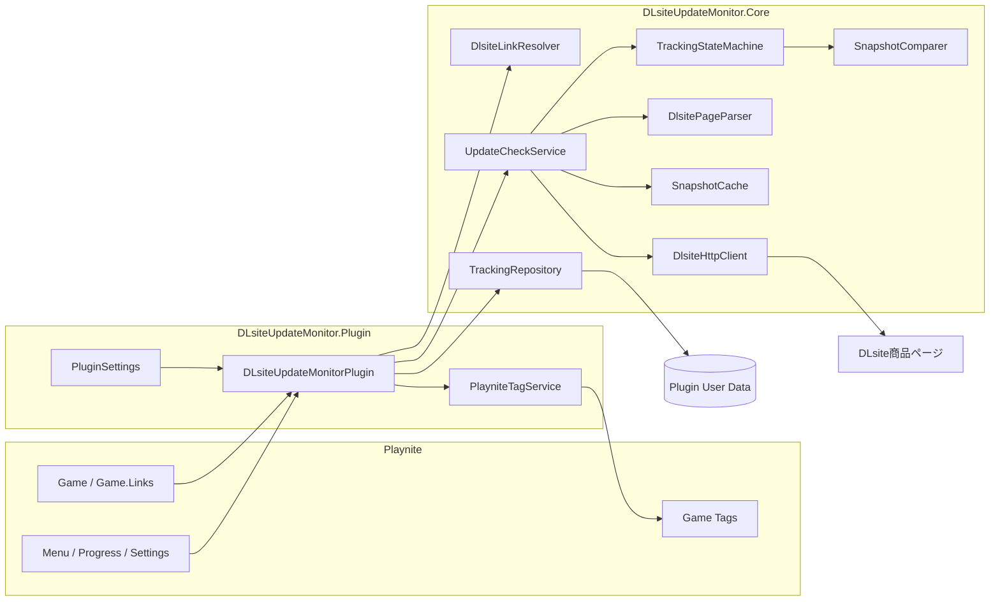
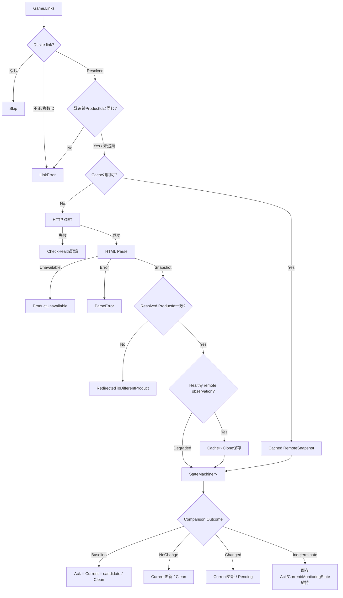

# アーキテクチャ

この文書は、DLsite Update Monitor v1.0.0の内部構造、データフロー、状態遷移、主要な設計判断をまとめます。

v1.0.0は、v0.1.0として実機検証していた現行実装を初回正式公開版として位置付けたVersionです。監視ロジックとTracking Schemaはv0.1.0検証時点から変更していません。

利用方法は [README.md](../README.md)、開発ルールと安全不変条件は [DEVELOPMENT.md](../DEVELOPMENT.md) を参照してください。

## 1. 全体構成



## 2. レイヤー境界

### `DLsiteUpdateMonitor.Plugin`

Playnite依存コードです。

責務:

- `GenericPlugin`としてのライフサイクル
- メインメニュー / Game context menu
- Settings UI
- Playnite global progress
- Playnite Game取得
- Core serviceの組み立て
- 保存タイミング
- タグ反映
- ユーザー確認ダイアログ
- 操作の排他制御

CoreへPlayniteモデルを直接持ち込むのではなく、必要なURLやGameIdを抽出して利用します。

### `DLsiteUpdateMonitor.Core`

Playnite SDKから独立したロジックです。

責務:

- DLsite URL / ProductId解決
- HTTP
- HTML parser
- 正規化
- RemoteSnapshot
- Snapshot validation / fingerprint / comparison
- Monitoring state machine
- memory cache
- Tracking JSON persistence

この分離によりCoreは.NET 8のxUnitテストで検証できます。

## 3. 主要コンポーネント

### Link resolution

```text
Game.Links
   ↓
DlsiteLinkResolver
   ↓
NoDlsiteLink / Invalid / Ambiguous / Resolved
```

`DlsiteLinkResolver`はhostとURL pathを検証します。

- 許可host: `dlsite.com`, `*.dlsite.com`
- ProductId抽出箇所: `/product_id/<ID>`
- ID: `[A-Z]{2}` + 6桁または8桁数字

異なる複数ProductIdが同一Gameへ登録されていても勝手に1つを選びません。

### Remote acquisition

```text
Resolved DLsite URL
   ↓
DlsiteHttpClient
   ↓
DlsiteFetchResult
```

通信はGETだけです。

`fetchGate`により同時DLsite requestを1本へ制限し、前回request開始時刻からの最小間隔を維持します。

### Parsing

```text
HTML
 ↓
AngleSharp
 ↓
#work_name
#work_outline
 ↓
UpdateInfo + FileSize
 ↓
normalize
 ↓
RemoteSnapshot
```

利用不可ページは通常parser contractより前に`.error_box_work`で検出します。

### Comparison

```text
AcknowledgedSnapshot + Candidate
        ↓
SnapshotValidator
        ↓
SnapshotComparer
        ↓
ComparisonResult
```

比較器そのものはrecordを変更しません。

### State transition

```text
ComparisonResult
      ↓
TrackingStateMachine
      ↓
GameTrackingRecord
```

比較と状態更新を分けることで、failure pathが既存Snapshotを壊さないようにしています。

### Persistence

```text
TrackingDatabase
   ↓ serialize
tracking.tmp
   ↓ reread + validate
tracking.json
   ↘ previous primary → tracking.backup.json
```

破損が確認された既存ファイルは保存前に`.corrupt-*`として退避されます。

## 4. 1ゲームのチェックフロー



## 5. バッチ処理

`DLsiteUpdateMonitorPlugin.CheckGames()`は対象Gameを順番に処理します。

### Product単位の共有

同一ProductIdがバッチ内に複数ある場合、`productResults`で最初の結果を覚えます。

#### 正常なRemoteSnapshotを再利用できる場合

2ゲーム目以降は`UpdateCheckService.CheckAsync(..., forceRefresh: false)`へ入り、cacheを使ってゲーム固有recordとの比較だけを行います。

#### Product-level取得が失敗した場合

同じバッチ中に同じProductIdへ何度もHTTP retryするのではなく、最初のfailure health/messageを後続recordにも記録します。

### 保存タイミング

- 10ゲーム処理ごと
- バッチ終了時

途中保存があるため、Playnite終了時にoperation中なら競合するshutdown saveを無理に行わずスキップします。

## 6. Snapshotの意味

### `AcknowledgedSnapshot`

ユーザーが確認済みとした比較基準。

Baseline作成時は初回Candidateのcloneです。

Pending中は変えません。

`適用済み`または`無視`でCurrentへ進みます。

### `CurrentSnapshot`

最新の**安全に比較できた**Candidate。

Pending中にDLsite側がさらに変化した場合は更新されます。

### `LastObservation`

直近の取得観測。

比較不能なdegraded Snapshotも診断のため保持される場合があります。

つまり`LastObservation`と`CurrentSnapshot`は同じ意味ではありません。

## 7. 観測状態

`ObservedField<T>`には値だけでなく状態があります。

```text
Missing   = 項目が存在しないことを有効に観測
Parsed    = 安全に解析済み
Unparsed  = 項目はあるが安全に解析不能
```

これを区別することが誤検知防止の中心です。

例えば`更新情報`が以前`Parsed`だったのに、HTML変更でrow自体を見失った場合、それを「更新情報が削除された」と断定せず`Indeterminate`へ倒します。

## 8. Comparison semantics

### UpdateInfo

| Before | After | Result |
|---|---|---|
| Missing | Missing | Same |
| Missing | Parsed | Changed |
| Parsed | Parsed同値 | Same |
| Parsed | Parsed差分 | Changed |
| Parsed | Missing | Indeterminate |
| Unparsedを含む | any | Indeterminate |

### FileSize

双方が`Parsed`の場合だけbyte値を比較します。

それ以外は`Indeterminate`です。

## 9. 状態とHealthを分離する理由

例:

```text
MonitoringState = PendingUpdateInfo
LastCheckHealth = Healthy
```

の次回checkでHTTP 429が起きた場合:

```text
MonitoringState = PendingUpdateInfo  ← 維持
LastCheckHealth = RateLimited        ← 更新
```

「今、未処理の変更があるか」と「最後のcheckは正常だったか」は別の事実です。

1つのenumへ統合すると、通信失敗で未処理更新を失う危険があります。

## 10. Product identity

旧Baselineを別作品へ誤用しないため、identityを複数段階で確認します。

### Link変更ガード

追跡済み`RequestedProductId`と、現在のPlaynite Linkから解決したProductIdが違う場合:

```text
LinkError
HTTP requestしない
Baseline維持
明示Resetを要求
```

### Redirectガード

DLsite GETがredirectし、最終ProductIdがrequestedと違う場合:

```text
RedirectedToDifferentProduct
Baselineを作成/更新しない
```

初回checkでもこの確認を行います。

## 11. HTTP設計

### 固定Cookie

```text
locale=ja_JP
loginchecked=1
```

認証Credentialではありません。

### User-Agent / language

ブラウザ相当User-Agentと日本語優先Accept-Languageを設定します。

### Retry

retry可能:

- 429
- timeout
- network error
- 5xx

retryしない:

- 403
- 404 / 410
- cancellation

`Retry-After`があれば優先します。

## 12. Cache設計

CacheはRemote observationの性質だけを表します。

あるPlaynite Gameのローカル`AcknowledgedSnapshot`が壊れていても、HTTPから得られたRemoteSnapshot自体がhealthyなら、同じProductIdを参照する別Gameで再利用できます。

この「remote health」と「local comparison health」の分離は意図的です。

## 13. Persistence failure modes

### primary正常

`tracking.json`を読み込みます。

### primary破損 / backup正常

backupを読み込み、startup warningを返します。

### primary/backup両方破損

新しいDBを生成します。ただし次回save前に破損ファイルを`.corrupt-*`へ保全します。

### 新しすぎるSchema

例外を投げ、Plugin側で`persistenceBlocked`にします。

新しい空DBでそのまま上書きする動作はしません。

## 14. Tag設計

`PlayniteTagService`はまず自分のtagを外し、その後MonitoringStateに応じて必要な1 tagを付けます。

```text
Prefix = [DLsite更新] 
```

このprefixで始まるtagだけが自管理対象です。

## 15. 設定変更

設定保存後にruntime serviceを再構築します。

```text
PluginSettings.EndEdit
  ↓
SavePluginSettings
  ↓
ReloadRuntimeSettings
  ↓
new DlsiteHttpClient
new SnapshotCache
new TrackingStateMachine
new UpdateCheckService
```

operation中なら即時再構築を避けます。実行中checkは開始時のruntime optionsで完了します。

Cacheはruntime service再構築時に新しいinstanceとなるため、設定保存によって既存memory cacheは引き継がれません。

## 16. 依存関係

### Core `net462`

- `System.Net.Http` explicit reference
- AngleSharp 0.9.9 (`ExcludeAssets=runtime`)
- Newtonsoft.Json 10.0.3 (`ExcludeAssets=runtime`)

### Core `net8.0`

- AngleSharp 0.9.9
- Newtonsoft.Json 10.0.3

### Plugin

- PlayniteSDK 6.16.0 (`ExcludeAssets=runtime`)
- System.Net.Http
- Core project reference

### Tests

- Microsoft.NET.Test.Sdk 18.10.0
- xunit.v3 4.0.0
- xunit.runner.visualstudio 4.0.0

## 17. ビルド成果物境界

配布payloadに必要:

```text
DLsiteUpdateMonitor.dll
DLsiteUpdateMonitor.Core.dll
extension.yaml
```

独自同梱しない:

```text
Playnite.SDK.dll
AngleSharp.dll
Newtonsoft.Json.dll
```

この境界は`Validate-Build.ps1`と`Package-Release.ps1`で検査されます。

## 18. 設計上の判断

### なぜ初回を更新扱いにしないか

初回には比較する既知基準がないためです。導入直後に全ゲームが更新扱いになる誤検知を避けます。

### なぜMissingとUnparsedを分けるか

「本当に項目がない」と「parserが読めなくなった」を区別するためです。

### なぜFileSizeを必須にするか

現行v1.0.0ではFileSizeが監視信号の1つであり、それが読めない候補を正常Snapshotとして確定すると、配布物変更を取り逃す可能性があるためです。

### なぜfailureでCurrentSnapshotを更新しないか

HTTP/DOM一時異常を新しい正常状態として確定しないためです。

### なぜProductId変更にResetが必要か

Playnite GameとDLsite作品の対応関係変更を、DLsite側の「更新」と混同しないためです。

### なぜHTTPを直列化するか

DLsiteへの負荷・rate limitを抑え、リクエスト間隔を一元管理するためです。

### なぜPlugin tagsにprefixを付けるか

自分が所有するタグだけを識別し、ユーザー作成タグを安全に残すためです。

## 19. 変更時に注意すべき境界

次の変更は影響範囲が大きいため、Unit Test + Smoke Testを必須と考えてください。

- ProductId regex
- DLsite DOM selector
- Missing / Unparsed semantics
- Fingerprint payload
- Tracking schema
- `AcknowledgedSnapshot`更新条件
- retry対象HTTP status
- `operationLock`
- save replacement logic
- Plugin tag prefix
- runtime DLL bundling policy

## 20. 現在の未自動化領域

- GitHub Actions / CI
- Playnite UI integration test
- `.pext`実機install test
- 全ライブラリSmoke Test
- GitHub Release作成
- Tag作成

これらを自動化する場合も、現在の段階的Gateを弱めず、**自動化された工程と人間の実機確認を区別**してください。
