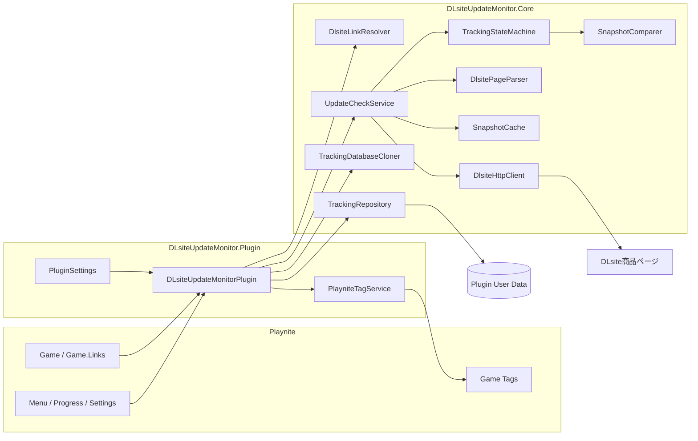

# アーキテクチャ

この文書は、DLsite Update Monitorの現在の内部構造、データフロー、状態遷移、主要な安全設計をまとめます。

公開済みv1.0.0は初回正式公開版です。現在のUnreleased候補では、Tracking Schema `1`を維持したまま、永続化、URL信頼境界、batch failure scope、診断/UIを強化しています。利用方法は [README.md](../README.md)、開発上の不変条件は [DEVELOPMENT.md](../DEVELOPMENT.md) を参照してください。

## 1. 全体構成



## 2. レイヤー境界

### `DLsiteUpdateMonitor.Plugin`

Playnite依存コードです。

- GenericPlugin lifecycle
- main / game context menu
- Settings UI
- global progress / cancel
- Game取得
- Core service組み立て
- batch orchestration
- durable save checkpoint
- tag同期
- tracking details / diagnostics
- error-only recheck
- orphan tracking cleanup
- operation排他

### `DLsiteUpdateMonitor.Core`

Playnite SDKから独立します。

- URL / ProductId resolution
- HTTP / retry / trust validation
- HTML parser / normalizer
- RemoteSnapshot / validation / fingerprint / comparison
- Monitoring state machine
- memory cache
- deep clone
- Tracking JSON persistence / recovery

Coreは.NET 8の自動テストで検証します。

## 3. Link resolution とURL信頼境界

```text
Game.Links
   ↓
DlsiteLinkResolver
   ↓
NoDlsiteLink / Invalid / Ambiguous / Resolved
```

Resolverの条件:

- absolute URI
- schemeは`http`または`https`
- hostは`dlsite.com`または`*.dlsite.com`
- `/product_id/<ID>`からProductIdを抽出
- IDは英字2文字 + 6桁または8桁数字
- HTTP URLはHTTPSへcanonicalize
- 異なる複数ProductIdは`Ambiguous`

HTTP responseでも最終URLを再検証します。

```text
Registered HTTP(S) DLsite URL
  ↓ Resolver: HTTPS canonicalization
HTTPS DLsite URL
  ↓ HttpClient / redirects
Final RequestUri
  ↓ trust check
absolute + HTTPS + dlsite.com/*.dlsite.com のみ受理
```

最終URLがHTTPや外部hostなら`UntrustedRedirect`です。Parserへ信頼できないHTMLを渡しません。

## 4. Remote acquisition

`DlsiteHttpClient`はGETのみです。`fetchGate`で同時DLsite requestを1本へ制限し、前回request開始時刻からの最小間隔を維持します。

Retry:

| 状況 | Retry |
|---|---|
| 429 | Yes (`Retry-After`優先) |
| Timeout | Yes |
| NetworkError | Yes |
| 5xx | Yes |
| 403 | No |
| 404 / 410 | No (`ProductUnavailable`) |
| その他4xx | No (`ClientError`) |
| Cancelled | No |
| Untrusted final URL | No |

固定Cookie `locale=ja_JP`, `loginchecked=1` は認証Credentialではありません。

## 5. Parsing

```text
HTML
 ↓ AngleSharp
#work_name + #work_outline
 ↓
UpdateInfo + FileSize
 ↓ normalize
RemoteSnapshot
```

HTTP 200の利用不可ページは`.error_box_work`で`ProductUnavailable`として検出します。

`ObservedField<T>`は次を区別します。

```text
Missing   = 項目が存在しないことを有効に観測
Parsed    = 安全に解析済み
Unparsed  = 項目はあるが安全に解析不能
```

resolved URLが存在する場合、SnapshotのProductIdはそのURLから抽出します。resolved URLからProductIdを抽出できないのにsource URLのProductIdで補って正常扱いしません。

## 6. Comparison / state transition

```text
AcknowledgedSnapshot + Candidate
        ↓ SnapshotValidator
        ↓ SnapshotComparer
ComparisonResult
        ↓ TrackingStateMachine
GameTrackingRecord
```

`SnapshotComparer`は副作用を持ちません。

- acknowledged == null → BaselineCreated
- ProductId mismatch → IdentityMismatch
- candidate comparison-ineligible → Indeterminate
- changed fields → Changed
- no difference → NoChange

`Indeterminate` / `IdentityMismatch`の`TargetState`はnullです。

StateMachine:

- Baseline → Ack = Current = candidate clone / Clean
- Changed → Current更新 / Pending
- NoChange → Current更新 / Clean
- failure / Indeterminate → Ack / Current / MonitoringState維持
- Acknowledge / Ignore → CurrentをAckへ進めClean
- Reset → snapshotsと作品identityをclear

## 7. Snapshotの意味

### `AcknowledgedSnapshot`

ユーザーが最後に確認済みとした比較基準。Pending中は自動で進みません。

### `CurrentSnapshot`

最新の**安全に比較可能だった**Candidate。

### `LastObservation`

直近の観測。degradedで比較不能でも診断目的に保持される場合があります。

`CurrentSnapshot`と`LastObservation`を同一視しないことがfail-closed設計の一部です。

## 8. Product identity とfailure scope

### Link変更ガード

既追跡`RequestedProductId`と現在のLink ProductIdが異なる場合、HTTP前に`LinkError`で停止します。明示Resetなしに旧Baselineを別作品へ流用しません。

### Redirectガード

最終resolved ProductIdがrequestedと異なれば`RedirectedToDifferentProduct`です。初回でもBaselineを作りません。

### Failure scope

`ProductCheckFailureScope`:

```text
LocalRecord   = GameTrackingRecord固有
RemoteProduct = ProductId共通のRemote取得側
```

同一ProductId batchで共有してよいのはRemote側の情報だけです。先頭Gameの旧ProductId mismatchなどLocalRecord failureを後続Gameへコピーしてはいけません。

## 9. Batch処理

`CheckGames()`はGameを順番に処理します。

同一ProductIdの重複抑制では、full HTMLをbatch dictionaryへ保持しません。`BatchProductResult`に次だけを保持します。

- reusable snapshotの有無
- health
- message

正常RemoteSnapshotは`SnapshotCache`経由で後続Gameへ再利用し、各GameのAckとの比較は独立して実行します。RemoteProduct failureは同batch内で共有できますが、LocalRecord failureは共有しません。

保存:

- 10 Gameごと
- batch終了時

## 10. Copy-on-write とdurable checkpoint

Pluginのmutating operationは共有`tracking`を先に変更しません。

```text
tracking
  ↓ TrackingDatabaseCloner.Clone
working
  ↓ StateMachine / remove orphan / etc.
repository.Save(working)
  ↓ success
tracking = working
```

Batch途中保存でも、保存成功後だけその状態をlive checkpointへ昇格します。後続save failure時に未保存mutationが残らないようにします。

この境界が必要な理由は、UIが「保存失敗」と表示した操作を後のshutdown save等で勝手に永続化させないためです。

## 11. Persistence

```text
TrackingDatabase
   ↓ serialize
tracking.tmp
   ↓ reread + validate
tracking.json
   ↘ previous healthy primary → tracking.backup.json
```

`ReadAndValidate`では:

- JSON deserialize
- `MaxDepth = 64`
- Schema範囲
- `Games != null`
- dictionary内のnull `GameTrackingRecord`拒否
- null Historyの補正

を行います。

### primary正常

primary使用。

### primary破損 / backup正常

backup使用 + warning。次saveでは破損primaryだけを`.corrupt-*`へ移し、**正常backupを保持したまま**新primaryを書きます。

### primary / backup両方破損

新DBを作成。次save前に両方を`.corrupt-*`へ保全します。

### 新しすぎるSchema

`UnsupportedTrackingSchemaException`。Pluginは`persistenceBlocked`として上書きを禁止します。

### save失敗

`LastSavedAtUtc`を呼び出し前の値へ戻して例外を伝播します。Plugin側もworking stateをliveへ昇格しません。

## 12. Cache

Cacheはprocess memoryのみ、keyはProductId、default TTL 24hです。Put/GetでSnapshotをcloneします。

Remote observation healthとGame固有comparison healthは別です。あるGameの壊れたAckが、同ProductIdの別Gameで健康なRemoteSnapshotを再利用することを妨げない設計です。

cache hitでもRemoteSnapshotの`FetchedAtUtc`は元のremote取得時刻を保持し、TTL用`StoredAtUtc`と分離します。

## 13. Tag設計

Plugin所有tagは正確に次の2つです。

```text
[DLsite更新] 更新あり
[DLsite更新] 配布物変更
```

prefix一致だけでは所有判定しません。`[DLsite更新] 自分用メモ`等のユーザーtagを削除しません。

| State | Tags |
|---|---|
| Uninitialized / Clean | なし |
| PendingUpdateInfo | 更新あり |
| PendingFileChange | 配布物変更 |
| PendingUpdateAndFileChange | **2つ両方** |

SummaryでもCombined stateは更新情報・配布物の双方へ計上し、`両方変更`件数を別表示します。

## 14. 設定

設定保存後にruntime servicesを再構築します。operation中なら即時rebuildを避けます。

保存済みsettingsがdeserializeできても範囲外数値なら、起動失敗させず該当項目を既定値へ補正します。

Cacheはruntime service再構築時に新instanceとなり、既存memory cacheは引き継ぎません。

## 15. 診断 / 補助UI

### Link diagnosis

正常/なし/不正/曖昧の件数だけでなく、問題Game名・理由、Ambiguous候補ProductIdを表示します。読み取り専用です。

### Targeted recheck

`LastCheckHealth`が`Healthy`でも`NeverChecked`でもないGameだけをforce refreshします。

### Tracking details

1 GameのState / Health / timestamps / Ack / Current / LastObservation / LastError / 最近10件Historyを読み取り専用で表示します。

### Orphan cleanup

Playnite DBに存在しないGameIdのtracking recordを候補化し、ProductId / GameId previewとYes/No確認後だけ削除します。cleanupもcopy-on-write + save success後swapです。

## 16. 依存関係とpayload境界

### Core net462

- System.Net.Http explicit reference
- AngleSharp 0.9.9 (`ExcludeAssets=runtime`)
- Newtonsoft.Json 10.0.3 (`ExcludeAssets=runtime`)

### Plugin

- PlayniteSDK 6.16.0 (`ExcludeAssets=runtime`)
- Core project reference

### 配布payload

必要:

```text
DLsiteUpdateMonitor.dll
DLsiteUpdateMonitor.Core.dll
extension.yaml
```

独自同梱しない:

```text
Playnite.SDK.dll
AngleSharp.dll
Newtonsoft.Json.dll
```

Playnite側runtimeとの互換性を再検証せず、警告だけを理由にこれらのruntime DLLをPluginへ同梱しません。

## 17. Build / CI

GitHub Actions:

- Ubuntu: .NET 8 Core tests + Static validation
- Windows: net462 Plugin restore/build
- Windows: payload境界検証
- Windows: exact buildからSmoke Test Artifact生成

Artifact:

```text
DLsiteUpdateMonitor-smoke-<commit SHA>
```

現行候補の自動検証はCore 72/72 PASS、Static PASS、Windows build PASS、payload境界PASSです。

Playnite UI integration、`.pext` install、全ライブラリは実機Gateです。

## 18. 設計上の判断

### 初回を更新扱いにしない

比較する既知基準がないためです。

### MissingとUnparsedを分ける

「項目が本当にない」と「parserが読めなくなった」を分け、DOM変更を更新と誤判定しないためです。

### FileSizeをcomparison条件にする

監視信号の1つが読めない候補を正常状態として確定すると、配布物変更を取り逃すためです。

### failureでCurrentを更新しない

HTTP/DOM一時異常を正常状態として確定しないためです。

### ProductId変更にResetを要求する

GameとDLsite作品の対応関係変更をRemote updateと混同しないためです。

### HTTPを直列化する

DLsiteへの負荷とrate limitを抑えるためです。

### Copy-on-writeにする

保存成功前のmutationを「確定済み」と見せないためです。

### Tagを正確な名称で所有する

同じ見た目のnamespaceを使うユーザーtagを削除しないためです。

### Orphanを自動削除しない

Playnite DBとの一時的不整合や誤認でtracking historyを不可逆に失わないためです。

## 19. 変更時に特に注意する境界

Unit Test + 必要なSmoke Testを必須と考える変更:

- ProductId regex / URL scheme / host trust
- redirect behavior
- DLsite DOM selector
- Missing / Unparsed semantics
- Fingerprint payload
- Tracking Schema
- `AcknowledgedSnapshot`更新条件
- failure scope
- retry対象status
- `operationLock`
- copy-on-write / checkpoint
- save / backup replacement logic
- Plugin owned tag names
- orphan cleanup
- runtime DLL bundling policy

## 20. 自動化と実機確認の境界

自動化済み:

- Core test
- Static validation
- Windows Plugin build
- payload境界
- Smoke用build Artifact生成

実機が必要:

- Playnite UI / menu / settings
- Game Database / tag integration
- real DLsite access behavior
- cancellation UX
- restart persistence
- orphan cleanup with actual Playnite DB
- full library smoke
- `.pext` install

自動化されたPASSと人間の実機確認を混同しないことがRelease gateの一部です。
